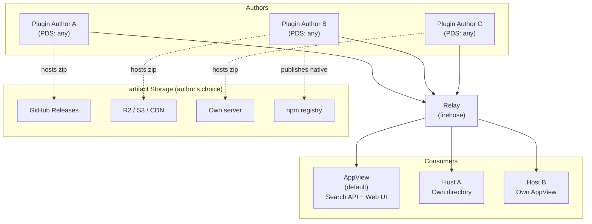
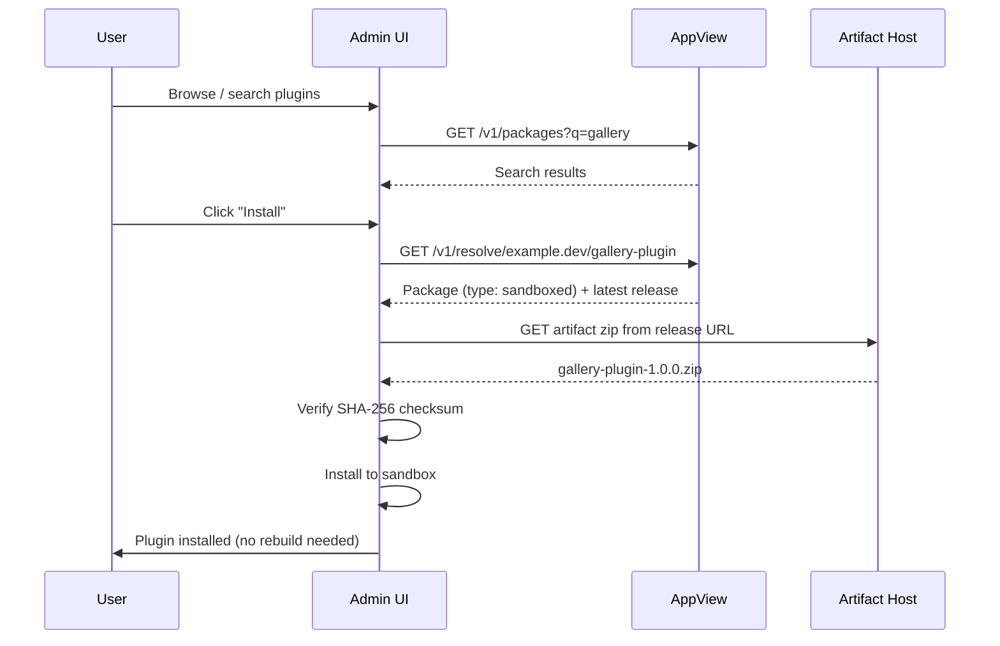
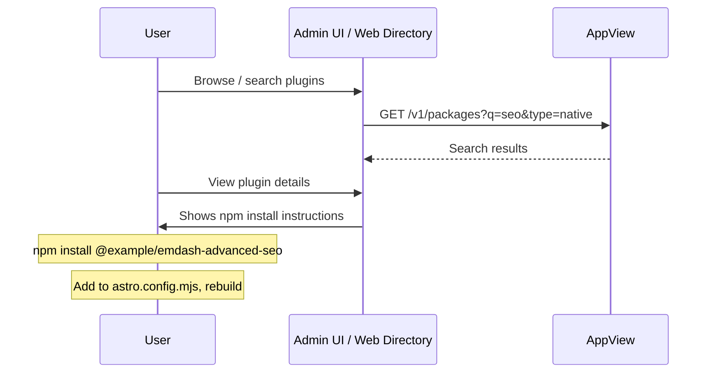
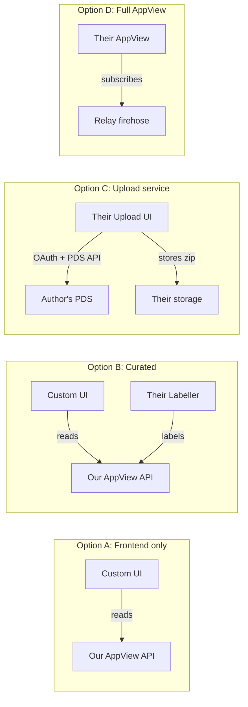

# RFC: Decentralised Plugin Registry

# Summary

A decentralised plugin registry for EmDash where authors publish package metadata as records in their own AT Protocol repositories. An AppView indexes these records from the network firehose to provide search and discovery. artifact binaries (zip files) are hosted by the author wherever they choose. Anyone can participate — as an author, a directory host, or a mirror — without permission from a central authority.

The registry supports both of EmDash's plugin types: **sandboxed** plugins that run in isolated Worker sandboxes and can be installed at runtime, and **native** plugins that are npm packages integrated into the Astro build pipeline with full platform access.

# Example

A plugin author with an existing Atmosphere account publishes a sandboxed plugin:

```bash
# Authenticate with your Atmosphere account
$ emdash plugin login
# Opens OAuth flow in browser, stores credentials locally

# Scaffold a new plugin project
$ emdash plugin init
# Creates a plugin.json manifest with prompts for name, description, etc.

# Publish a release from a local directory
$ emdash plugin publish ./my-gallery/
# On first publish: creates the package record in the author's atproto repo
# Zips the directory, hashes it, uploads to the default artifact host, creates a release record

# Or publish from an existing zip
$ emdash plugin publish ./my-gallery-1.0.0.zip
# Hashes the zip, uploads it, creates a release record

# Or publish with an already-hosted artifact
$ emdash plugin publish --url https://github.com/example/gallery/releases/download/v1.0.0/gallery-1.0.0.zip
# Fetches the zip to compute the hash, creates a release record pointing to the URL
```

Or a native plugin, distributed via npm:

```bash
# Scaffold a native plugin project
$ emdash plugin init --type native
# Creates a plugin.json manifest with npmPackage field

# Publish a release that references an npm version
$ emdash plugin publish --npm @example/emdash-advanced-seo@1.0.0
# Verifies package.json contains matching DID, creates a release record
```

A CMS user installs either type:

- **Sandboxed plugins** are installed from the admin UI. The admin searches the registry, picks a plugin, and installs it with one click — no CLI, no rebuild.
- **Native plugins** are discovered through the registry (admin UI or web directory), then installed via `npm install` and added to the Astro config. The registry tells you what to install; npm handles the installation.

The package record is stored in the author's own atproto repository, signed by their keys, and indexed by the AppView for discovery.

# Background & Motivation

Centralised plugin registries create single points of failure, control and trust. When one organisation controls the registry, they control the supply chain. We've seen this play out repeatedly:

- The WordPress ecosystem's dependency on WordPress.org and the governance disputes that led to FAIR.
- npm's `left-pad` incident, where a single package removal broke thousands of builds.
- RubyGems, PyPI and other registries where a compromised account can push malicious updates to thousands of consumers.

In all of these cases, the root problem is the same: a central registry that conflates identity, hosting, discovery and trust into a single service under a single operator's control.

We want a plugin ecosystem where:

- Authors own their identity and their package metadata. It lives in their own repository, signed by their own keys, and is portable if they move providers.
- Anyone can host artifacts. There is no requirement to upload to a blessed server.
- Anyone can run a directory. Multiple competing directories can index the same package data with different curation, moderation and presentation.
- No single point of failure. If the primary AppView goes down, plugins can still be resolved directly from the author's Personal Data Server.

The AT Protocol gives us identity, cryptographic signing, data portability and a global event stream as existing infrastructure. Rather than building all of this from scratch, we build a thin application layer on top.

# Goals

- **Zero-infrastructure publishing.** A plugin author needs only an Atmosphere account (e.g. a Bluesky or npmx account) and optionally a URL where they host their zip file.
- **Decentralised discovery.** An AppView indexes package records from the atproto firehose. Anyone can run their own AppView to build competing directories.
- **Cryptographic integrity.** Every package record is signed as part of the author's atproto repository. artifact checksums in signed records provide transitive verification of downloads.
- **Portability.** Authors can migrate their Atmosphere account between providers without losing their packages. Their DID stays the same, their records come with them.
- **Low barrier for hosts and third parties.** A hosting provider should be able to offer a plugin directory or upload service with minimal effort — a client library and an API, not a full infrastructure deployment.
- **Social trust layer.** Reviews, ratings and reports are records published by users in their own repos (with an interface for this built into EmDash), tied to verified atproto identities.
- **Unified ecosystem.** A single registry and discovery mechanism for both sandboxed and native plugins, with the install flow adapting to the plugin type.

# Non-Goals

- **Replacing atproto infrastructure.** We do not build or run a PDS, relay, or DID directory. We use existing infrastructure.
- **Mandating a specific artifact host.** Authors choose where to host their zip files. We offer an optional upload service as a convenience, but it is not required.
- **Content moderation at the protocol level.** Moderation is handled by labellers and AppViews, not baked into the data model. Different directories can apply different moderation policies.
- **Supporting private/authenticated packages in the initial version.** Paid and private plugins are a future extension. The initial design focuses on public, open-source packages.
- **FAIR protocol compatibility.** While we draw on FAIR's metadata design as prior art, we do not aim for wire-level compatibility with FAIR clients. The architectures are fundamentally different (HTTP repository polling vs. atproto firehose indexing). A compatibility layer could be added later if needed.
- **Dependency resolution.** The initial version supports declaring dependencies, but we defer complex resolution to a future RFC.
- **Replacing npm for native plugins.** The registry provides discovery, identity and metadata for native plugins, but npm remains the distribution mechanism. We don't reimplement package management.

# Prior Art

## FAIR Package Manager

[FAIR](https://fair.pm/) (Federated And Independent Repositories) is a decentralised package manager built for the WordPress ecosystem, backed by the Linux Foundation. It uses W3C Decentralised Identifiers (DIDs) as package identifiers and defines HTTP APIs for repository servers to serve metadata.

FAIR validates the general approach of decentralised package identity using DIDs, but differs architecturally:

|                       | FAIR                                          | This proposal                                              |
| --------------------- | --------------------------------------------- | ---------------------------------------------------------- |
| Identity model        | One DID per package                           | One DID per author, multiple packages per account          |
| Metadata transport    | Custom HTTP repository API                    | atproto records in the author's repo                       |
| Author infrastructure | Must run or use a repository server           | Only needs an Atmosphere account                           |
| Discovery             | Aggregators crawl repositories                | AppView subscribes to the relay firehose                   |
| Signing               | Separate verification method on DID documents | Repo-level signing (records are signed as part of the MST) |
| Social layer          | None                                          | Reviews, ratings and reports as atproto records            |
| artifact hosting      | Repository serves binaries                    | Author hosts anywhere; URL + checksum in release record    |

## npm, crates.io, PyPI

Traditional centralised registries. Authors publish to a single server that handles storage, discovery, identity and trust. The model works well at scale but concentrates control and creates supply chain risk. Our design separates these concerns across independent infrastructure.

# Detailed Design

# AT Protocol Primer

This proposal builds on the [AT Protocol](https://atproto.com/guides/overview) ("atproto"), the decentralised social publishing protocol originally developed at Twitter. It now primarily used to power the social network Bluesky, which also leads protocol development. It is also used for third-party services such as [Tangled](https://tangled.org/) (Git hosting), [Leaflet](https://leaflet.pub) (blogging) and [Streamplace](https://stream.place/) (live streaming). Here are the key concepts used throughout this document:

- **[Atmosphere account](https://atmosphereaccount.com/)** — A portable digital identity on the AT Protocol network. One account works across all Atmosphere apps (Bluesky, Tangled, Leaflet, etc.) and is hosted by a provider the user chooses — an app like Bluesky, an independent host, or self-hosted infrastructure. The account can move between providers without losing data or identity. When this document refers to an "Atmosphere account", it means any account on an AT Protocol-compatible PDS.

- **[DID](https://atproto.com/specs/did)** (Decentralized Identifier) — A permanent, globally unique identifier for an account (e.g. `did:plc:ewvi7nxzyoun6zhxrhs64oiz`). Defined as a W3C standard. DIDs resolve to documents containing the account's cryptographic keys and hosting location. Think of them like a portable UUID that also tells you where to find the account's data. FAIR also uses DIDs as package identifiers.

- **[Handle](https://atproto.com/specs/handle)** — A human-readable domain name mapped to a DID (e.g. `cloudflare.social` or `jay.bsky.team`). Handles are mutable — you can change yours — but your DID stays the same.

- **[PDS](https://atproto.com/guides/overview#personal-data-server-pds)** (Personal Data Server) — The server that hosts an account's data, and where a user signs up for an account. Bluesky runs PDSs for its users, but anyone can run their own and they are all interoprable. Other services that provide PDSs include [npmx](https://npmx.social), [Blacksky](https://blackskyweb.xyz/) and [Eurosky](https://eurosky.tech/). [Cirrus](https://github.com/ascorbic/cirrus/) lets you self-host a PDS in a Cloudflare Worker. If your PDS disappears, you can migrate to a new one because your identity is rooted in your DID, not in the server.

- **[Repository](https://atproto.com/specs/repository)** — A user's public dataset, stored as a signed Merkle Search Tree (MST) in their PDS. Every record in a repo is covered by the tree's cryptographic signature, so you can verify that any record really was published by the account's owner.

- **[Lexicon](https://atproto.com/specs/lexicon)** — A schema language for describing record types and APIs, similar to JSON Schema. Applications define lexicons to declare the shape of data they read and write. Lexicons are identified by NSIDs (Namespaced Identifiers) in reverse-DNS format, e.g. `site.standard.document` or `app.bsky.feed.post`.

- **[AT URI](https://atproto.com/specs/at-uri-scheme)** — A URI scheme for referencing specific records: `at://<did>/<collection>/<rkey>`. For example, `at://did:plc:abc123/com.emdashcms.registry.package/gallery-plugin`.

- **[Relay and Firehose](https://atproto.com/specs/sync)** — Relays aggregate data from many PDSes into a single event stream (the "firehose"). Any service can subscribe to the firehose to receive real-time notifications of record creates, updates and deletes across the entire network. Bluesky operates two public relays, and there are a number of third-party relays available too.

- **[AppView](https://atproto.com/guides/overview)** — A service that subscribes to the firehose, indexes records it cares about, and serves an API for clients. Think of it like a specialised search engine for a particular type of atproto data. Unlike most other atproto services, the AppView is not generic, and is generally custom-built for a particular service where it implements the business logic of that app. Bluesky runs one AppView, as do third-party services such as [Leaflet](https://leaflet.pub/) or [Streamplace](https://stream.place/).

- **[Labeller](https://atproto.com/specs/label)** — A service that publishes signed labels about records or accounts (e.g. "verified", "spam", "nsfw"). Labels are a lightweight moderation primitive that can be consumed by AppViews and clients.

## Plugin Types

EmDash supports two types of plugin with fundamentally different runtime and distribution models. The registry handles both, but the install flow differs.

### Sandboxed plugins

Sandboxed plugins run in isolated sandboxes. The default sandbox is implemented via Cloudflare Dynamic Workers. They declare a capability manifest specifying exactly what resources they can access (e.g. `read:content`, `email:send`). They can be installed at runtime from the admin UI — no CLI, no build step, no restart required.

```js
export default () =>
	definePlugin({
		id: "notify-on-publish",
		capabilities: ["read:content", "email:send"],
		hooks: {
			"content:afterSave": async (event, ctx) => {
				/* ... */
			},
		},
	});
```

For these plugins, the registry is the **complete distribution channel**: discovery → download → verify → install, all automated.

### Native plugins

Native plugins are npm packages that integrate into the Astro build pipeline. They have full access to the Node.js runtime and can provide Astro components, API routes, middleware, custom block types — anything. Installation requires `npm install`, a config change, and a rebuild/redeploy.

```js
// astro.config.mjs
import formPlugin from "@example/emdash-advanced-forms";
export default defineConfig({
	integrations: [emdash({ plugins: [formPlugin()] })],
});
```

For these plugins, the registry is a **discovery and metadata layer**. It adds value over npm alone because:

- The author's identity is atproto-verified, not just an npm username.
- Reviews and ratings are tied to verified atproto identities.
- The registry knows it's an EmDash plugin specifically (npm doesn't).
- The labeller can flag security issues in an EmDash-aware way.
- Users get a unified directory for the whole EmDash ecosystem.

npm remains the distribution mechanism for native plugins. The registry does not attempt to replace it.

## Architecture Overview



**Authors** publish `package` and `release` records to their own PDS via standard atproto APIs. EmDash will provide a CLI command to do this, so users don't need to use the APIs directly. For sandboxed plugins, they host artifact zip files wherever they choose. For native plugins, they publish to npm as usual.

**The relay** broadcasts all record operations via the firehose. This is existing atproto infrastructure — we do not run it.

**AppViews** subscribe to the firehose, filter for our lexicon namespace, and build a searchable index. We run the default AppView and publish an open source reference implementation. Anyone else can run their own.

**EmDash clients** built-in to the dashboard, these query an AppView for discovery, but can also resolve packages directly from an author's PDS. This means the system degrades gracefully — if the AppView is down, known packages can still be installed.

## Lexicons

All lexicons will probably use the namespace `com.emdashcms.*`.

### `com.emdashcms.registry.package`

Describes a plugin package. Stored in the author's repo with the slug as the record key, producing human-readable AT URIs like:

```
at://did:plc:abc123/com.emdashcms.registry.package/gallery-plugin
```

Or, using a handle:

```
at://example.dev/com.emdashcms.registry.package/gallery-plugin
```

**Schema:**

| Property       | Type              | Required | Description                                                                                                                                              |
| -------------- | ----------------- | -------- | -------------------------------------------------------------------------------------------------------------------------------------------------------- |
| `slug`         | string            | yes      | URL-safe package identifier, matching the record key. `[a-z][a-z0-9\-_]*`, max 64 chars.                                                                 |
| `name`         | string            | yes      | Human-readable package name. Max 200 chars.                                                                                                              |
| `description`  | string            | yes      | Short package description. Max 500 chars.                                                                                                                |
| `type`         | string            | yes      | Plugin type: `"sandboxed"` or `"native"`.                                                                                                                |
| `license`      | string            | yes      | SPDX licence expression, or `"proprietary"`.                                                                                                             |
| `authors`      | Author[]          | yes      | At least one author.                                                                                                                                     |
| `capabilities` | string[]          | no       | Declared capability manifest for sandboxed plugins (e.g. `["read:content", "email:send"]`). Required if type is `sandboxed`. Ignored for native plugins. |
| `npmPackage`   | string            | no       | npm package name for native plugins (e.g. `"@example/emdash-advanced-seo"`). Required if type is `native`.                                               |
| `security`     | Contact[]         | no       | Security contacts. Recommended.                                                                                                                          |
| `homepage`     | string (uri)      | no       | URL to project homepage (docs site, marketing page, etc.).                                                                                               |
| `repository`   | Repository        | no       | Source code repository. Used by tooling for "view source", "file an issue", and provenance cross-checks.                                                 |
| `keywords`     | string[]          | no       | Search keywords. Max 10 items.                                                                                                                           |
| `readme`       | string            | no       | Long-form description. Markdown. Max 50,000 chars.                                                                                                       |
| `createdAt`    | string (datetime) | yes      | ISO 8601 creation timestamp.                                                                                                                             |

**Author object:**

| Property | Type         | Required |
| -------- | ------------ | -------- |
| `name`   | string       | yes      |
| `url`    | string (uri) | no       |
| `email`  | string       | no       |

**Contact object:**

| Property | Type         | Required |
| -------- | ------------ | -------- |
| `url`    | string (uri) | no       |
| `email`  | string       | no       |

At least one of `url` or `email` must be provided per contact.

**Repository object:**

| Property    | Type         | Required | Description                                                                                                        |
| ----------- | ------------ | -------- | ------------------------------------------------------------------------------------------------------------------ |
| `type`      | string       | yes      | Repository type. Typically `"git"`.                                                                                |
| `url`       | string (uri) | yes      | Clone or browse URL (e.g. `https://github.com/example/emdash-gallery`, `https://tangled.sh/@example.dev/gallery`). |
| `directory` | string       | no       | Subpath within the repo, for monorepos (e.g. `packages/gallery`).                                                  |

### `com.emdashcms.registry.release`

Describes a release of a package. The record key is auto-generated (a [TID](https://atproto.com/specs/record-key)).

**Schema:**

| Property     | Type              | Required    | Description                                                                                                                                               |
| ------------ | ----------------- | ----------- | --------------------------------------------------------------------------------------------------------------------------------------------------------- |
| `package`    | string (at-uri)   | yes         | AT URI of the package record this release belongs to.                                                                                                     |
| `version`    | string            | yes         | Semver version string.                                                                                                                                    |
| `url`        | string (uri)      | conditional | URL where the artifact can be downloaded. Required for sandboxed plugins (the zip URL). Not present for native plugins (npm is the distribution channel). |
| `checksum`   | string            | conditional | `sha256:<hex>` checksum of the artifact. Required for sandboxed plugins. Not present for native plugins.                                                  |
| `npmVersion` | string            | conditional | Exact npm version string for native plugins (e.g. `"@example/emdash-advanced-seo@1.0.0"`). Required if package type is `native`.                          |
| `changelog`  | string            | no          | Release notes. Markdown. Max 10,000 chars.                                                                                                                |
| `requires`   | object            | no          | Dependencies and platform requirements.                                                                                                                   |
| `provides`   | object            | no          | Capabilities this release provides.                                                                                                                       |
| `suggests`   | object            | no          | Optional companion packages.                                                                                                                              |
| `createdAt`  | string (datetime) | yes         | ISO 8601 creation timestamp.                                                                                                                              |

**Dependency format (`requires`):**

Keys are either AT URIs (for plugin dependencies) or `env:`-prefixed strings (for platform requirements). Values are semver range strings.

```json
{
	"requires": {
		"at://did:plc:xyz/com.emdashcms.registry.package/image-utils": ">=1.0.0",
		"env:emdash": ">=0.2.0",
		"env:node": ">=18.0.0"
	}
}
```

### `com.emdashcms.registry.review`

A user review of a package. Published in the reviewer's own repo.

**Schema:**

| Property    | Type              | Required | Description                           |
| ----------- | ----------------- | -------- | ------------------------------------- |
| `package`   | string (at-uri)   | yes      | AT URI of the package being reviewed. |
| `rating`    | integer           | yes      | 1–5 star rating.                      |
| `body`      | string            | no       | Review text. Max 2,000 chars.         |
| `createdAt` | string (datetime) | yes      | ISO 8601 creation timestamp.          |

### `com.emdashcms.registry.report`

A report against a package (security issue, malware, policy violation). Published in the reporter's own repo.

**Schema:**

| Property    | Type              | Required | Description                                       |
| ----------- | ----------------- | -------- | ------------------------------------------------- |
| `package`   | string (at-uri)   | yes      | AT URI of the package being reported.             |
| `type`      | string            | yes      | One of: `security`, `malware`, `policy`, `other`. |
| `body`      | string            | yes      | Description of the issue. Max 5,000 chars.        |
| `createdAt` | string (datetime) | yes      | ISO 8601 creation timestamp.                      |

## Package Resolution

### Sandboxed plugin install flow



### Native plugin install flow

Native plugins are discovered through the registry but installed via npm. The registry provides the npm package name and version; the user runs the install themselves.



### By handle and slug (user-facing)

```
@example.dev/gallery-plugin
```

1. Resolve handle `example.dev` to a DID via the atproto handle resolution mechanism.
2. Construct the AT URI: `at://<did>/com.emdashcms.registry.package/gallery-plugin`.
3. Fetch the package record from the author's PDS.
4. Fetch the latest release record (by `createdAt` or semver ordering).
5. **If sandboxed:** Download the artifact from the URL in the release record. Verify the SHA-256 checksum. Install to the sandbox.
6. **If native:** Display the npm package name and version. The user installs via npm and configures their Astro config themselves.

### Fallback behaviour

The EmDash client should attempt resolution in this order:

1. **AppView API** — fast, cached, has aggregated metadata (ratings, download counts).
2. **Author's PDS directly** — slower, but works independently of the AppView.

This means the registry is resilient to AppView downtime for users who already know the package identifier.

## The Publish Flow

On first publish, the CLI reads `plugin.json` and creates the `com.emdashcms.registry.package` record in the author's atproto repo. Subsequent publishes create release records against the existing package. This means there's no separate "register" step — publishing is the only way a package appears in the registry.

### Sandboxed plugins

The `emdash plugin publish` command supports three modes for specifying the artifact:

#### From a directory

```bash
$ emdash plugin publish ./my-gallery/
```

1. Zips the directory contents deterministically.
2. Computes the SHA-256 checksum of the zip.
3. Uploads the zip to the configured artifact host (default: the EmDash upload service; configurable to any S3-compatible endpoint or custom upload target).
4. Creates a `com.emdashcms.registry.release` record in the author's repo with the resulting URL and checksum.

This is the lowest-friction path. The author doesn't need to zip, host, or hash anything manually.

#### From a zip file

```bash
$ emdash plugin publish ./my-gallery-1.0.0.zip
```

1. Computes the SHA-256 checksum of the provided zip.
2. Uploads the zip to the configured artifact host.
3. Creates the release record.

Useful when the author has a build step that produces a zip, or when the zip is built by CI.

#### From a URL

```bash
$ emdash plugin publish --url https://github.com/example/gallery/releases/download/v1.0.0/gallery-1.0.0.zip
```

1. Fetches the zip from the URL to compute the SHA-256 checksum.
2. Creates the release record pointing to the provided URL (no re-upload).

Useful when the author already has their artifact hosted — e.g. as a GitHub Release asset or on their own CDN. The CLI verifies the URL is reachable and the checksum is valid, but doesn't upload anything.

#### artifact host configuration

The CLI defaults to uploading to the EmDash artifact upload service (see [Reference Implementations](#reference-implementations) below). Authors can configure an alternative:

```json
// plugin.json
{
	"artifactHost": {
		"type": "s3",
		"bucket": "my-plugins",
		"endpoint": "https://my-r2.example.com",
		"prefix": "releases/"
	}
}
```

Or simply always use `--url` to manage hosting themselves.

### Native plugins

```bash
$ emdash plugin publish --npm @example/emdash-advanced-seo@1.0.0
```

1. Fetches the npm package metadata from the registry.
2. Verifies that the `package.json` contains an `emdash.author` field matching the authenticated Atmosphere account's DID.
3. Creates the release record with the `npmVersion` field. No artifact URL or checksum — npm is the distribution channel.

The author publishes to npm as they normally would. The `emdash plugin publish --npm` step creates the registry record that links the npm package to their atproto identity. This is a separate step from `npm publish` — it registers the release in the EmDash directory, it doesn't replace npm.

The GitHub Action can automate both steps: `npm publish` followed by `emdash plugin publish --npm`.

### npm ownership verification

For native plugins, the registry needs to verify that the person creating the registry record actually owns the npm package. We do this via a `package.json` field:

```json
{
	"name": "@example/emdash-advanced-seo",
	"emdash": {
		"author": "did:plc:abc123"
	}
}
```

The `emdash.author` field contains the DID of the Atmosphere account authorised to register this package in the EmDash registry. The CLI verifies this field matches the authenticated account at publish time. The AppView can also periodically re-verify it and apply a `verified-npm` label for packages where the cross-reference still holds.

This is a one-time setup cost: the author adds the field and publishes to npm once. Subsequent releases only need the `emdash plugin publish --npm` step.

If the `emdash.author` field is missing or doesn't match, the CLI refuses to create the registry record. There is no "unverified" path — ownership must be provable.

## Components

### What we build and host

**AppView (default instance)**

The core indexing service. Subscribes to a relay firehose, filters for `com.emdashcms.registry.*` records, indexes into a database, and serves a public read API.

API surface:

| Endpoint                                      | Description                                                                                           |
| --------------------------------------------- | ----------------------------------------------------------------------------------------------------- |
| `GET /v1/packages`                            | List/search packages. Supports `?q=` for search, `?type=sandboxed\|native` for filtering, pagination. |
| `GET /v1/packages/:did/:slug`                 | Get a specific package by author DID and slug.                                                        |
| `GET /v1/packages/:did/:slug/releases`        | List releases for a package.                                                                          |
| `GET /v1/packages/:did/:slug/releases/latest` | Get the latest release.                                                                               |
| `GET /v1/packages/:did/:slug/reviews`         | List reviews for a package.                                                                           |
| `GET /v1/resolve/:handle/:slug`               | Convenience: resolve a handle to a DID and return the package.                                        |

**Web directory (default instance)**

A browsable website for searching and viewing plugins. Reads from the AppView API. Displays package details, release history, author info, reviews and install instructions. Plugins are filterable by type, with the UI clearly indicating whether a plugin is sandboxed (installable from the admin panel) or native (requires CLI and rebuild).

**Lexicons**

The lexicon definitions, published as JSON in a public repository. These are the protocol's source of truth.

### What we build and distribute (not hosted)

**CLI tool (`emdash plugin`)**

A subcommand of the EmDash CLI for publishing and managing plugins. Communicates with the author's PDS via atproto OAuth for writes, and with the AppView for reads.

Commands:

| Command                                          | Description                                                   |
| ------------------------------------------------ | ------------------------------------------------------------- |
| `emdash plugin login`                            | Authenticate via atproto OAuth.                               |
| `emdash plugin init`                             | Scaffold a `plugin.json` manifest (like `npm init`).          |
| `emdash plugin publish <dir\|zip\|--url\|--npm>` | Publish a release. See [The Publish Flow](#the-publish-flow). |
| `emdash plugin search <query>`                   | Search the AppView index.                                     |
| `emdash plugin info <handle/slug>`               | Display package details and latest release.                   |

**Client library (npm package)**

A TypeScript library wrapping the lexicon operations for third-party integrations:

```ts
import { RegistryClient } from "@emdash/plugin-registry";

const client = new RegistryClient({
	appView: "https://registry.emdashcms.com",
});

// Discovery (reads from AppView)
const results = await client.search("gallery");
const nativeOnly = await client.search("seo", { type: "native" });
const pkg = await client.getPackage("example.dev", "gallery-plugin");
const latest = await client.getLatestRelease("example.dev", "gallery-plugin");

// Publishing a sandboxed plugin (writes to PDS via OAuth agent)
await client.createPackage(agent, {
	slug: "gallery-plugin",
	name: "Gallery Plugin",
	type: "sandboxed",
	capabilities: ["read:content", "read:media"],
	description: "A beautiful image gallery.",
	license: "MIT",
	authors: [{ name: "example", url: "https://example.dev" }],
});

// Publishing a native plugin
await client.createPackage(agent, {
	slug: "advanced-seo",
	name: "Advanced SEO",
	type: "native",
	npmPackage: "@example/emdash-advanced-seo",
	description: "Comprehensive SEO tooling for EmDash.",
	license: "MIT",
	authors: [{ name: "example", url: "https://example.dev" }],
});
```

**GitHub Action**

Automates publishing on tag or release. The author configures it once; every GitHub Release automatically publishes a release record to their atproto repo.

```yaml
name: Publish Plugin
on:
  release:
    types: [published]

jobs:
  publish:
    runs-on: ubuntu-latest
    steps:
      - uses: actions/checkout@v4
      # For sandboxed plugins:
      - uses: emdash-cms/publish-plugin-action@v1
        with:
          atproto-handle: ${{ secrets.ATPROTO_HANDLE }}
          atproto-app-password: ${{ secrets.ATPROTO_APP_PASSWORD }}
          artifact-url: ${{ github.event.release.assets[0].browser_download_url }}

      # For native plugins (after npm publish):
      - uses: emdash-cms/publish-plugin-action@v1
        with:
          atproto-handle: ${{ secrets.ATPROTO_HANDLE }}
          atproto-app-password: ${{ secrets.ATPROTO_APP_PASSWORD }}
          npm-package: "@example/emdash-advanced-seo@${{ github.event.release.tag_name }}"
```

### What we build and optionally host

**artifact upload service**

For sandboxed plugin authors who don't want to manage artifact hosting. A simple endpoint: POST a zip (authenticated via atproto OAuth), receive a URL. Rate-limited and size-limited. Entirely optional — a convenience, not a requirement. Not used by native plugins (they use npm).

**artifact caching proxy**

A proxy that caches artifact downloads on first fetch. Content-addressed by checksum, so immutable and deduplicatable. Provides resilience against author-hosted URLs going down, and gives us download statistics.

The EmDash client can be configured to fetch via the cache, falling back to the direct URL:

```
https://cache.emdashcms.com/artifacts/sha256:abc123...
```

Primarily useful for sandboxed plugins. Native plugin artifacts are served by npm, which has its own CDN and caching.

**Labeller**

An atproto labeller service that applies trust and moderation labels to package records:

| Label               | Meaning                                                                                                                  |
| ------------------- | ------------------------------------------------------------------------------------------------------------------------ |
| `verified-author`   | Author's handle resolves to a domain they demonstrably control.                                                          |
| `verified-npm`      | For native plugins: the npm package's `emdash.author` field matches the registry record's DID. Re-verified periodically. |
| `security-reviewed` | Package has undergone a security review.                                                                                 |
| `security-flagged`  | A confirmed security issue has been reported.                                                                            |
| `malware`           | Package has been identified as malicious.                                                                                |
| `deprecated`        | Author has marked the package as unmaintained.                                                                           |

These labels are consumed by AppViews and directories to inform display and filtering. Different AppViews can choose which labellers to trust.

### What we do NOT build

- **A PDS.** Authors use any existing PDS — Bluesky's hosted service, a self-hosted instance, or any other compliant PDS.
- **A relay.** We subscribe to existing relay infrastructure.
- **A custom signing system.** atproto's repo-level signing is sufficient. We do not need a separate signing ceremony as FAIR requires.
- **A DID directory.** We use the existing [PLC directory](https://plc.directory/) and [did:web](https://atproto.com/specs/did) resolution.

## Reference Implementations

We provide reference implementations for every component in the system. Some we host as default instances; others are published for anyone to self-host. The goal is that every layer of the stack can be run independently.

| Component                   | What it is                                             | We host a default?                    | Others can run their own?                                           |
| --------------------------- | ------------------------------------------------------ | ------------------------------------- | ------------------------------------------------------------------- |
| **Lexicons**                | JSON schema definitions for `com.emdashcms.registry.*` | n/a (published in a Git repo)         | n/a                                                                 |
| **AppView**                 | Firehose consumer + index + read API                   | ✅ Yes                                | ✅ Yes — subscribe to the relay, index the same records             |
| **Web directory**           | Browsable plugin directory website                     | ✅ Yes                                | ✅ Yes — reads from any AppView API                                 |
| **CLI (`emdash plugin`)**   | Publish, search and manage plugins                     | n/a (distributed via npm)             | n/a                                                                 |
| **Client library**          | TypeScript SDK for third-party integrations            | n/a (published to npm)                | n/a                                                                 |
| **GitHub Action**           | Automated publish on release                           | n/a (published to GitHub Marketplace) | n/a                                                                 |
| **artifact upload service** | Simple zip upload → URL endpoint                       | ✅ Yes                                | ✅ Yes — any S3-compatible storage works                            |
| **artifact caching proxy**  | Content-addressed cache for artifact downloads         | ✅ Yes                                | ✅ Yes — useful for hosting providers who want supply chain control |
| **Labeller**                | Moderation and trust labels                            | ✅ Yes                                | ✅ Yes — anyone can run a labeller; AppViews choose which to trust  |

The reference AppView, upload service and caching proxy are designed to run on Cloudflare Workers + D1 + R2, but the reference implementations are not Cloudflare-specific in their interfaces — only in their deployment target. A host using AWS, Fly, or bare metal could reimplement the same APIs against their own infrastructure.

The web directory reference implementation is an Astro site that reads from the AppView API. It can be deployed anywhere Astro runs.

## Third-Party Integration

### Hosting a directory

A third party that wants to offer their own plugin directory has several options, in increasing order of effort:



**Option A: Frontend only.** Build a UI that queries the public AppView API. Zero backend infrastructure. Could be a static site.

**Option B: Curated directory.** Maintain a list of endorsed packages — either as atproto records (endorsement records in their own repo) or via a labeller that applies `host-recommended` labels. Their directory UI filters by these signals.

**Option C: Upload and publish service.** Offer a web UI where authors authenticate via atproto OAuth, upload a zip, and publish. The host stores the zip (their own storage) and creates the release record in the author's repo via the PDS API using the OAuth token. The record still lives in the author's repo, signed by their keys, portable if they leave. The host is just providing a nice UI and artifact storage.

**Option D: Full AppView.** Subscribe to the relay firehose, build their own index, serve their own API. Complete independence from our infrastructure.

In all cases, the package data is the same — it's all coming from authors' atproto repos. A host adds value through curation, UI, storage and convenience, not through controlling access to the data.

## Security Model

### Identity and provenance

Every package record is part of an atproto [repository](https://atproto.com/specs/repository), which is a Merkle Search Tree signed by the account's signing key. This means:

- The AppView can verify that a package record was published by the DID that claims to own it.
- Records cannot be forged by third parties.
- If the AppView is compromised, clients can independently verify records by fetching from the author's PDS and checking the repo signature.

### artifact integrity

The release record contains a `sha256` checksum of the artifact (zip or npm tarball). Because the record itself is signed (as part of the repo MST), the checksum is transitively authenticated. A client verifies:

1. The release record belongs to the expected DID (via repo signature).
2. The downloaded artifact matches the checksum in the record.

For native plugins, the registry does not duplicate npm's own integrity mechanisms. Instead, it provides identity verification: the `emdash.author` field in `package.json` ties the npm package to a specific atproto DID, and the CLI verifies this at publish time. This means the registry can confirm that the person who registered the plugin in the EmDash directory is the same person who publishes the npm package. npm handles artifact integrity; the registry handles identity.

### Key rotation and revocation

atproto handles key rotation at the DID level. If an author's key is compromised, they rotate it via the [PLC directory](https://plc.directory/) (or did:web update). Existing records remain valid (they were signed by the old key at the time), but new records must use the new key. This is handled transparently by the PDS.

### Plugin type and trust

The `type` field in the package record is an important trust signal that the admin UI should surface clearly:

- **Sandboxed plugins** run with declared, enforced capabilities. The admin UI can show "This plugin requests read:content and email:send" and the user can make an informed decision knowing the sandbox enforces those boundaries.
- **Native plugins** have full platform access. The admin UI should clearly communicate this: "This is a native plugin. It runs with full platform access and requires a rebuild to install." This is not a warning about quality — it's information about the trust model.

The labeller can apply additional trust signals on top (verified author, security reviewed, etc.) that apply equally to both types.

### Threat model

| Threat                          | Mitigation                                                                                                                                                                                                                                                                                                                                     |
| ------------------------------- | ---------------------------------------------------------------------------------------------------------------------------------------------------------------------------------------------------------------------------------------------------------------------------------------------------------------------------------------------- |
| Compromised author account      | Key rotation via DID. Labeller can flag affected packages.                                                                                                                                                                                                                                                                                     |
| Malicious package               | Reports via `com.emdashcms.registry.report`. Labeller applies `malware` / `security-flagged` labels. AppViews filter based on labels.                                                                                                                                                                                                          |
| AppView compromise              | Clients can verify records directly from author PDS. Checksums are checked client-side.                                                                                                                                                                                                                                                        |
| artifact host compromise        | Checksums in signed records detect tampered zips. Caching proxy provides redundancy.                                                                                                                                                                                                                                                           |
| npm account compromise (native) | The `emdash.author` DID in `package.json` is set by the legitimate owner. A compromised npm account could publish a new version, but can't retroactively create a matching registry record without also compromising the Atmosphere account. The AppView can detect when a new npm version lacks a corresponding registry release and flag it. |
| PDS goes down                   | Author migrates to another PDS. DID stays the same. artifact cache preserves downloads.                                                                                                                                                                                                                                                        |
| Relay goes down                 | Multiple relays exist in the atproto network. AppView can subscribe to alternatives.                                                                                                                                                                                                                                                           |

# Testing Strategy

## Protocol-level testing

- **Lexicon validation:** Automated tests that verify record creation and validation against the lexicon schemas, for both sandboxed and native package types.
- **Round-trip tests:** Create package and release records on a test PDS, verify they appear in the AppView index, verify the EmDash client can resolve and install from them.
- **Checksum verification:** Test that the EmDash client correctly rejects sandboxed plugin artifacts with mismatched checksums.
- **npm ownership verification:** Test that the CLI rejects native plugin registration when the npm package's `emdash.author` field is missing or doesn't match the authenticated DID.
- **Fallback resolution:** Test that the EmDash client falls back to PDS-direct resolution when the AppView is unreachable.

## Integration testing

- **End-to-end publish flow:** CLI login → init → publish (all modes: directory, zip, URL, npm) → verify record exists → verify AppView indexes it → verify EmDash can install it.
- **GitHub Action:** Trigger a release, verify the action creates the correct release record for both plugin types.
- **Third-party directory:** Verify a frontend-only directory can read and display packages from the AppView API, with correct type filtering.

## Adversarial testing

- **Tampered artifacts:** Serve a zip with a checksum mismatch; verify the client rejects it.
- **Mismatched npm ownership:** Attempt to create a registry record for an npm package whose `emdash.author` field contains a different DID; verify the CLI and AppView reject it.
- **Forged records:** Attempt to create records claiming to be from a different DID; verify the AppView and client reject them.
- **Stale cache:** Verify the caching proxy correctly serves content-addressed artifacts and doesn't serve stale data for updated checksums.

# Drawbacks

- **Dependency on atproto infrastructure.** The system relies on the atproto relay network and PDS ecosystem being available and functioning. If atproto as a whole experiences issues, the registry is affected. However, the fallback-to-PDS design means the system degrades gracefully rather than failing entirely.

- **Atmosphere account required for authors.** Authors must have an Atmosphere account (practically, a Bluesky account) to publish. This is a lower barrier than running a server, but it's still a dependency on a specific ecosystem. If atproto adoption stagnates, this could limit the author pool.

- **No built-in artifact hosting.** The "bring your own URL" model is flexible but puts the burden on the author. The directory and URL publish modes mitigate this (the CLI can upload for you), and the caching proxy adds resilience, but ultimately the author's artifact URL is the source of truth.

- **Lexicon immutability.** Atproto lexicons are difficult to change once records exist in the wild. The schema design needs to be right from the start, or we need a clear versioning/migration strategy.

- **New concept for most plugin authors.** Most CMS plugin developers are not familiar with atproto, DIDs, or decentralised protocols. The tooling (CLI, GitHub Action) must abstract this completely so that the publish experience feels as simple as `npm publish`.

- **Two publish steps for native plugins.** Native plugin authors must publish to npm _and_ create a registry record. The GitHub Action automates this, but it's still an extra step compared to just using npm. Authors who skip the registry record won't appear in the EmDash directory.

# Alternatives

## Use FAIR directly

Adopt the FAIR protocol as-is, writing an EmDash-specific extension. This would mean each package gets its own DID, authors run (or use) a FAIR repository server, and we build an aggregator for discovery.

**Why not:** Higher infrastructure burden on authors. No social layer. Weaker discovery (crawling vs. firehose). The WordPress-specific reference implementation provides little reusable code for EmDash.

## Build a traditional centralised registry

Run a server. Authors create accounts. Packages are uploaded to our storage. We handle identity, discovery, trust and hosting.

**Why not:** This is the model we're explicitly trying to avoid. It concentrates control, creates a single point of failure, and makes us the bottleneck for the entire ecosystem.

## Use IPFS / content-addressed storage

Host artifacts on IPFS or a similar content-addressed network. Package metadata could be published as IPNS records or via a smart contract.

**Why not:** IPFS has persistent availability and performance issues for this use case. The tooling maturity is significantly behind atproto. We'd still need to solve identity and discovery separately.

## Use ActivityPub

Publish packages as ActivityPub objects. Directories are ActivityPub servers that follow author accounts.

**Why not:** ActivityPub's data model isn't well suited for structured, queryable records. There's no equivalent of the firehose for efficient indexing. Identity is server-bound, not portable. The protocol is designed for social messaging, not structured data distribution.

## Separate registries for sandboxed and native plugins

Run two independent systems — the atproto-based registry for sandboxed plugins, and just use npm search/discovery for native plugins.

**Why not:** Fragments the ecosystem. Users would need to look in two places. The value of a unified directory with consistent identity, reviews and trust signals applies equally to both plugin types. The marginal cost of supporting native plugins in the same registry is low — it's mostly metadata and a different install flow.

# Adoption Strategy

## For plugin authors

1. **Phase 1 — CLI.** Authors install the EmDash CLI, authenticate with their Atmosphere account, and publish with two commands. This is the minimum viable experience.
2. **Phase 2 — GitHub Action.** Authors add a GitHub Action to their repo. Publishing becomes automatic on release. This is the "set it and forget it" experience.
3. **Phase 3 — Web UI.** Authors can publish through a web interface if they prefer not to use the CLI.

We dogfood the system first by publishing EmDash's own first-party plugins through it.

## For EmDash users

EmDash ships with the registry client built in. Users search for and install plugins through the admin UI or CLI. The experience should feel identical to a centralised registry — the decentralisation is invisible. The admin UI clearly distinguishes sandboxed plugins (installable with one click) from native plugins (require CLI and rebuild).

## For hosting providers and third parties

We provide the client library on npm. A host can integrate plugin browsing and installation into their platform with minimal effort. We document the AppView API and provide examples of building custom directories. All reference implementations are open source and designed to be self-hosted.

# Implementation Plan

## Phase 1: Foundation

- Design and publish lexicons. This blocks everything else and is worth spending disproportionate time on.
- Build the AppView: firehose subscription, record indexing, read API.
- Build the CLI: login, init, publish (all modes including `--npm`), search.
- Wire up the admin UI's plugin install flow for sandboxed plugins (search, install, verify checksum).

Milestone: "I can publish a plugin of either type and someone else can install it."

## Phase 2: Ecosystem

- Build the web directory (Astro site reading from AppView API), with type filtering and clear UX for sandboxed vs. native.
- Build and publish the GitHub Action (supporting both plugin types).
- Publish the client library to npm.
- Build the artifact upload service.

Milestone: "Publishing is easy, discovery is pleasant."

## Phase 3: Trust

- Build the artifact caching proxy.
- Build the labeller for moderation and trust signals.
- Enable the review and report lexicons in the AppView.
- Implement verified-author labelling (handle → domain verification).

Milestone: "The ecosystem is resilient and trustworthy."

# Unresolved Questions

- **Slug uniqueness.** Slugs are unique per author (scoped by DID), not globally. Should the AppView enforce or signal global uniqueness? How do we handle two authors publishing `gallery-plugin`?

- **Version ordering.** Do we determine the "latest" release by semver ordering or by `createdAt` timestamp? Semver is more correct but requires all authors to use valid semver.

- **Large artifacts.** Should we set a maximum artifact size? What's reasonable for EmDash plugins — 50 MB? 100 MB?

- **Record deletion semantics.** What happens when an author deletes a package or release record? Should the AppView retain a tombstone? Should the caching proxy continue serving the artifact?

- **Multi-author packages.** Can a package have multiple accounts authorised to publish releases? atproto records are per-account, so this may need a delegation mechanism or a shared account.

- **Signature verification depth.** Should the EmDash client verify repo signatures on install, or trust the AppView's verification? Verifying locally is more secure but adds complexity and requires fetching the repo proof.

- **Capability manifest source of truth.** For sandboxed plugins, the `capabilities` field in the package record and the capability manifest in `definePlugin()` declare the same information. Which is authoritative? Should the CLI validate that they match at publish time? Should the sandbox enforce based on the record or the code?

- **Type migration.** Can a plugin change from sandboxed to native (or vice versa) across versions? What are the implications for existing installations?
