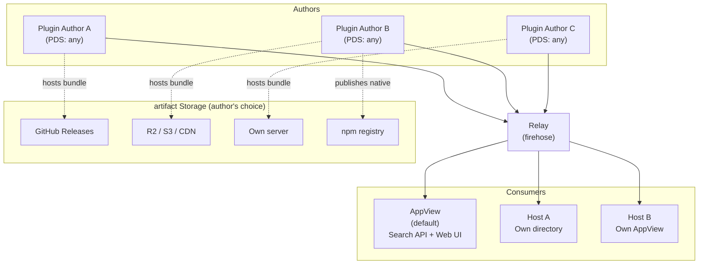
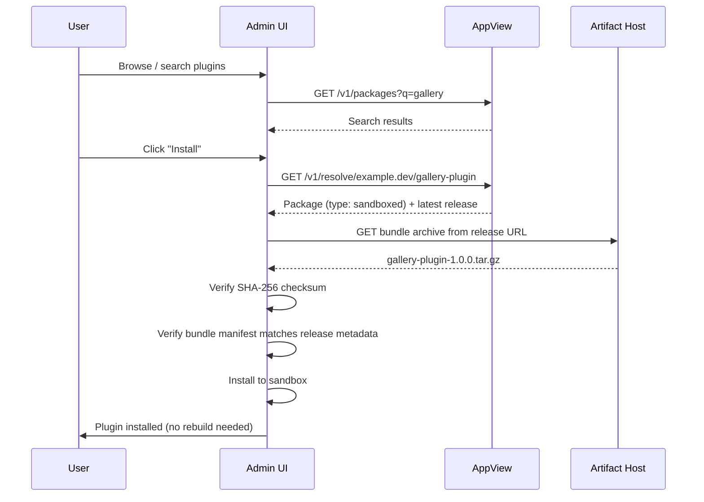
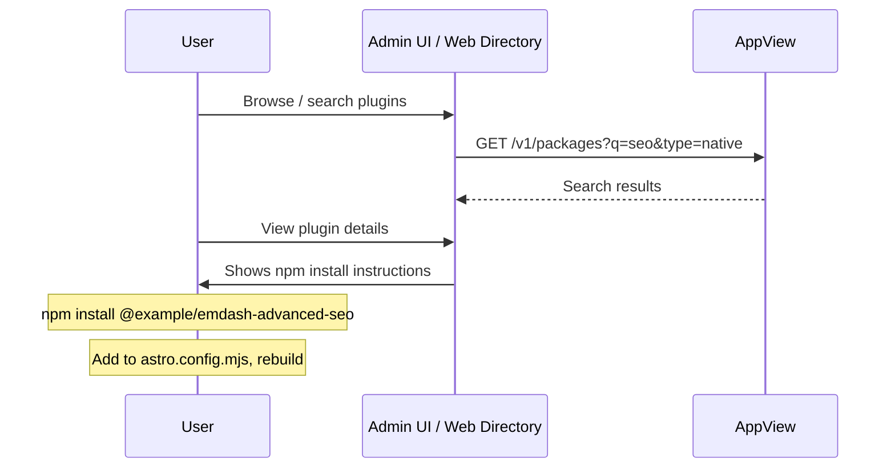
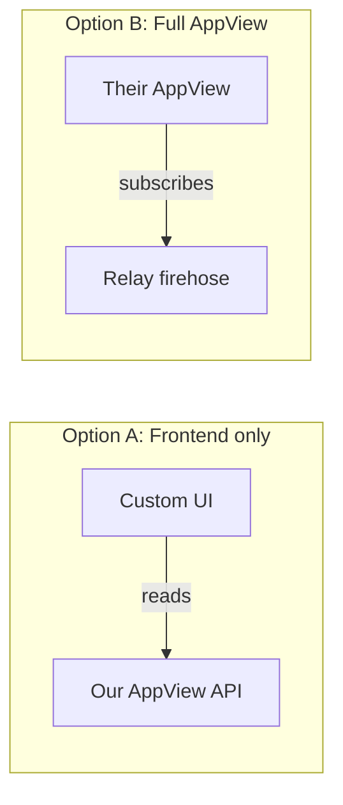

# RFC: Decentralised Plugin Registry

# Summary

A decentralised plugin registry for EmDash where authors publish package metadata as records in their own AT Protocol repositories. An AppView indexes these records from the network firehose to provide search and discovery. Sandboxed plugin bundles (`.tar.gz` archives) are hosted by the author wherever they choose. Anyone can participate — as an author, a directory host, or a mirror — without permission from a central authority.

The registry supports both of EmDash's plugin types: **sandboxed** plugins that run in isolated Worker sandboxes and can be installed at runtime, and **native** plugins that are npm packages integrated into the Astro build pipeline with full platform access.

# Example

A plugin author with an existing Atmosphere account publishes a sandboxed plugin:

```bash
# Authenticate with your Atmosphere account
$ emdash plugin login
# Opens OAuth flow in browser, stores credentials locally

# Scaffold a new plugin project
$ emdash plugin init
# Creates a plugin.json manifest with prompts for name, description, etc.

# Publish a release with an already-hosted artifact
$ emdash plugin publish --url https://github.com/example/gallery/releases/download/v1.0.0/gallery-plugin-1.0.0.tar.gz
# Fetches the bundle to compute the hash, creates the package record on first publish,
# then creates a release record pointing to the URL
```

Or a native plugin, distributed via npm:

```bash
# Scaffold a native plugin project
$ emdash plugin init --type native
# Creates a plugin.json manifest with npmPackage field

# Publish a release that references an npm version
$ emdash plugin publish --npm @example/emdash-advanced-seo@1.0.0
# Verifies package.json contains matching DID, creates a release record
```

A CMS user installs either type:

- **Sandboxed plugins** are installed from the admin UI. The admin searches the registry, picks a plugin, and installs it with one click — no CLI, no rebuild.
- **Native plugins** are discovered through the registry (admin UI or web directory), then installed via `npm install` and added to the Astro config. The registry tells you what to install; npm handles the installation.

The package record is stored in the author's own atproto repository, signed by their keys, and indexed by the AppView for discovery.

# Background & Motivation

Centralised plugin registries create single points of failure, control and trust. When one organisation controls the registry, they control the supply chain. We've seen this play out repeatedly:

- The WordPress ecosystem's dependency on WordPress.org and the governance disputes that led to FAIR.
- npm's `left-pad` incident, where a single package removal broke thousands of builds.
- RubyGems, PyPI and other registries where a compromised account can push malicious updates to thousands of consumers.

In all of these cases, the root problem is the same: a central registry that conflates identity, hosting, discovery and trust into a single service under a single operator's control.

We want a plugin ecosystem where:

- Authors own their identity and their package metadata. It lives in their own repository, signed by their own keys, and is portable if they move providers.
- Anyone can host artifacts. There is no requirement to upload to a blessed server.
- Anyone can run a directory. Multiple competing directories can index the same package data with different curation, moderation and presentation.
- No single point of failure. If the primary AppView goes down, plugins can still be resolved directly from the author's Personal Data Server.

The AT Protocol gives us identity, cryptographic signing, data portability and a global event stream as existing infrastructure. Rather than building all of this from scratch, we build a thin application layer on top.

# Goals

- **Zero-infrastructure publishing.** A plugin author needs only an Atmosphere account (e.g. a Bluesky or npmx account) and optionally a URL where they host their bundle artifact.
- **Decentralised discovery.** An AppView indexes package records from the atproto firehose. Anyone can run their own AppView to build competing directories.
- **Cryptographic integrity.** Every package record is signed as part of the author's atproto repository. artifact checksums in signed records provide transitive verification of downloads.
- **Portability.** Authors can migrate their Atmosphere account between providers without losing their packages. Their DID stays the same, their records come with them.
- **Low barrier for hosts and third parties.** A hosting provider should be able to offer a plugin directory with minimal effort, using a client library and an API rather than a fully bespoke registry stack.
- **Unified ecosystem.** A single registry and discovery mechanism for both sandboxed and native plugins, with the install flow adapting to the plugin type.

# Non-Goals

- **Replacing atproto infrastructure.** We do not build or run a PDS, relay, or DID directory. We use existing infrastructure.
- **Mandating a specific artifact host.** Authors choose where to host their bundle artifacts. The initial design assumes a published artifact URL.
- **Trust and moderation primitives in v1.** Reviews, reports, labellers and other social or moderation features are planned, but will be specified in later RFCs.
- **Supporting private/authenticated packages in the initial version.** Paid and private plugins are a future extension. The initial design focuses on public, open-source packages.
- **FAIR protocol compatibility.** While we draw on FAIR's metadata design as prior art, we do not aim for wire-level compatibility with FAIR clients. The architectures are fundamentally different (HTTP repository polling vs. atproto firehose indexing). A compatibility layer could be added later if needed.
- **Dependency metadata and resolution in v1.** Compatibility and dependency declarations are planned, but will be specified in a later RFC.
- **Replacing npm for native plugins.** The registry provides discovery, identity and metadata for native plugins, but npm remains the distribution mechanism. We don't reimplement package management.

# Prior Art

## FAIR Package Manager

[FAIR](https://fair.pm/) (Federated And Independent Repositories) is a decentralised package manager built for the WordPress ecosystem, backed by the Linux Foundation. It uses W3C Decentralised Identifiers (DIDs) as package identifiers and defines HTTP APIs for repository servers to serve metadata.

FAIR validates the general approach of decentralised package identity using DIDs, but differs architecturally:

|                       | FAIR                                          | This proposal                                              |
| --------------------- | --------------------------------------------- | ---------------------------------------------------------- |
| Identity model        | One DID per package                           | One DID per author, multiple packages per account          |
| Metadata transport    | Custom HTTP repository API                    | atproto records in the author's repo                       |
| Author infrastructure | Must run or use a repository server           | Only needs an Atmosphere account                           |
| Discovery             | Aggregators crawl repositories                | AppView subscribes to the relay firehose                   |
| Signing               | Separate verification method on DID documents | Repo-level signing (records are signed as part of the MST) |
| Ratings, reviews etc  | None                                          | Deferred to follow-on RFCs                                 |
| artifact hosting      | Repository serves binaries                    | Author hosts anywhere; URL + checksum in release record    |

## npm, crates.io, PyPI

Traditional centralised registries. Authors publish to a single server that handles storage, discovery, identity and trust. The model works well at scale but concentrates control and creates supply chain risk. Our design separates these concerns across independent infrastructure.

# Detailed Design

# AT Protocol Primer

This proposal builds on the [AT Protocol](https://atproto.com/guides/overview) ("atproto"), the decentralised social publishing protocol originally developed at Twitter. It now primarily used to power the social network Bluesky, which also leads protocol development. It is also used for third-party services such as [Tangled](https://tangled.org/) (Git hosting), [Leaflet](https://leaflet.pub) (blogging) and [Streamplace](https://stream.place/) (live streaming). Here are the key concepts used throughout this document:

- **[Atmosphere account](https://atmosphereaccount.com/)** — A portable digital identity on the AT Protocol network. One account works across all Atmosphere apps (Bluesky, Tangled, Leaflet, etc.) and is hosted by a provider the user chooses — an app like Bluesky, an independent host, or self-hosted infrastructure. The account can move between providers without losing data or identity. When this document refers to an "Atmosphere account", it means any account on an AT Protocol-compatible PDS.

- **[DID](https://atproto.com/specs/did)** (Decentralized Identifier) — A permanent, globally unique identifier for an account (e.g. `did:plc:ewvi7nxzyoun6zhxrhs64oiz`). Defined as a W3C standard. DIDs resolve to documents containing the account's cryptographic keys and hosting location. Think of them like a portable UUID that also tells you where to find the account's data. FAIR also uses DIDs as package identifiers.

- **[Handle](https://atproto.com/specs/handle)** — A human-readable domain name mapped to a DID (e.g. `cloudflare.social` or `jay.bsky.team`). Handles are mutable — you can change yours — but your DID stays the same.

- **[PDS](https://atproto.com/guides/overview#personal-data-server-pds)** (Personal Data Server) — The server that hosts an account's data, and where a user signs up for an account. Bluesky runs PDSs for its users, but anyone can run their own and they are all interoprable. Other services that provide PDSs include [npmx](https://npmx.social), [Blacksky](https://blackskyweb.xyz/) and [Eurosky](https://eurosky.tech/). [Cirrus](https://github.com/ascorbic/cirrus/) lets you self-host a PDS in a Cloudflare Worker. If your PDS disappears, you can migrate to a new one because your identity is rooted in your DID, not in the server.

- **[Repository](https://atproto.com/specs/repository)** — A user's public dataset, stored as a signed Merkle Search Tree (MST) in their PDS. Every record in a repo is covered by the tree's cryptographic signature, so you can verify that any record really was published by the account's owner.

- **[Lexicon](https://atproto.com/specs/lexicon)** — A schema language for describing record types and APIs, similar to JSON Schema. Applications define lexicons to declare the shape of data they read and write. Lexicons are identified by NSIDs (Namespaced Identifiers) in reverse-DNS format, e.g. `site.standard.document` or `app.bsky.feed.post`.

- **[AT URI](https://atproto.com/specs/at-uri-scheme)** — A URI scheme for referencing specific records: `at://<did>/<collection>/<rkey>`. For example, `at://did:plc:abc123/com.emdashcms.registry.package/gallery-plugin`.

- **[Relay and Firehose](https://atproto.com/specs/sync)** — Relays aggregate data from many PDSes into a single event stream (the "firehose"). Any service can subscribe to the firehose to receive real-time notifications of record creates, updates and deletes across the entire network. Bluesky operates two public relays, and there are a number of third-party relays available too.

- **[AppView](https://atproto.com/guides/overview)** — A service that subscribes to the firehose, indexes records it cares about, and serves an API for clients. Think of it like a specialised search engine for a particular type of atproto data. Unlike most other atproto services, the AppView is not generic, and is generally custom-built for a particular service where it implements the business logic of that app. Bluesky runs one AppView, as do third-party services such as [Leaflet](https://leaflet.pub/) or [Streamplace](https://stream.place/).

- **[Labeller](https://atproto.com/specs/label)** — A service that publishes signed labels about records or accounts (e.g. "verified", "spam", "nsfw"). Labels are a lightweight moderation primitive that can be consumed by AppViews and clients.

## Plugin Types

EmDash supports two types of plugin with fundamentally different runtime and distribution models. The registry handles both, but the install flow differs.

### Sandboxed plugins

Sandboxed plugins run in isolated sandboxes. The default sandbox is implemented via Cloudflare Dynamic Workers. Their bundle manifest declares exactly what resources they can access, including capabilities such as `read:content` and `email:send`. They can be installed at runtime from the admin UI — no CLI, no build step, no restart required.

```js
export default () =>
	definePlugin({
		id: "notify-on-publish",
		capabilities: ["read:content", "email:send"],
		hooks: {
			"content:afterSave": async (event, ctx) => {
				/* ... */
			},
		},
	});
```

For these plugins, the registry is the **complete distribution channel**: discovery → download → verify → install, all automated.

### Native plugins

Native plugins are npm packages that integrate into the Astro build pipeline. They have full access to the Node.js runtime and can provide Astro components, API routes, middleware, custom block types — anything. Installation requires `npm install`, a config change, and a rebuild/redeploy.

```js
// astro.config.mjs
import formPlugin from "@example/emdash-advanced-forms";
export default defineConfig({
	integrations: [emdash({ plugins: [formPlugin()] })],
});
```

For these plugins, the registry is a **discovery and metadata layer**. It adds value over npm alone because:

- The author's identity is atproto-verified, not just an npm username.
- The registry knows it's an EmDash plugin specifically (npm doesn't).
- Users get a unified directory for the whole EmDash ecosystem.

npm remains the distribution mechanism for native plugins. The registry does not attempt to replace it.

## Architecture Overview



**Authors** publish `package` and `release` records to their own PDS via standard atproto APIs. EmDash will provide a CLI command to do this, so users don't need to use the APIs directly. For sandboxed plugins, they host bundle tarballs wherever they choose. For native plugins, they publish to npm as usual.

**The relay** broadcasts all record operations via the firehose. This is existing atproto infrastructure — we do not run it.

**AppViews** subscribe to the firehose, filter for our lexicon namespace, and build a searchable index. We run the default AppView and publish an open source reference implementation. Anyone else can run their own.

**EmDash clients** built-in to the dashboard, these query an AppView for discovery, but can also resolve packages directly from an author's PDS. This means the system degrades gracefully — if the AppView is down, known packages can still be installed.

## Lexicons

All lexicons will probably use the namespace `com.emdashcms.*`.

### `com.emdashcms.registry.package`

Describes a plugin package. Stored in the author's repo with the slug as the record key, producing human-readable AT URIs like:

```
at://did:plc:abc123/com.emdashcms.registry.package/gallery-plugin
```

Or, using a handle:

```
at://example.dev/com.emdashcms.registry.package/gallery-plugin
```

**Schema:**

| Property      | Type              | Required | Description                                                                                                                                                          |
| ------------- | ----------------- | -------- | -------------------------------------------------------------------------------------------------------------------------------------------------------------------- |
| `slug`        | string            | yes      | URL-safe package slug, matching the record key. Combined with the author DID, it forms the canonical package identity `did/slug`. `[a-z][a-z0-9\-_]*`, max 64 chars. |
| `name`        | string            | yes      | Human-readable package name. Max 200 chars.                                                                                                                          |
| `description` | string            | yes      | Short package description. Max 500 chars.                                                                                                                            |
| `type`        | string            | yes      | Plugin type: `"sandboxed"` or `"native"`.                                                                                                                            |
| `license`     | string            | yes      | SPDX licence expression, or `"proprietary"`.                                                                                                                         |
| `authors`     | Author[]          | yes      | At least one author.                                                                                                                                                 |
| `npmPackage`  | string            | conditional | npm package name for native plugins (e.g. `"@example/emdash-advanced-seo"`). Required if type is `native`. Must not be present if type is `sandboxed`.              |
| `security`    | Contact[]         | no       | Security contacts. Recommended.                                                                                                                                      |
| `homepage`    | string (uri)      | no       | URL to project homepage (docs site, marketing page, etc.).                                                                                                           |
| `repository`  | Repository        | no       | Source code repository. Used by tooling for "view source", "file an issue", and provenance cross-checks.                                                             |
| `keywords`    | string[]          | no       | Search keywords. Max 10 items.                                                                                                                                       |
| `readme`      | string            | no       | Long-form description. Markdown. Max 50,000 chars.                                                                                                                   |
| `createdAt`   | string (datetime) | yes      | ISO 8601 creation timestamp.                                                                                                                                         |

**Package identity:**

- The canonical package identity is `did/slug`.
- The canonical record reference is the package record's AT URI, for example `at://did:plc:abc123/com.emdashcms.registry.package/gallery-plugin`.
- EmDash implementations may derive a local runtime key from `did/slug` for storage, routing or namespacing. That encoding is implementation-defined, but it must remain stable for a given package identity.

**Runtime plugin identity:**

- A plugin may also have a runtime plugin ID used inside EmDash.
- Runtime plugin IDs are not the canonical registry identity. The registry identity is always `did/slug`.
- For sandboxed plugins, the runtime plugin ID is declared in the bundle manifest.
- For native plugins, the runtime plugin ID is declared by the exported plugin descriptor.
- Runtime plugin IDs need not equal `did/slug`.
- Runtime plugin IDs must remain stable across releases of the same package.
- EmDash implementations should persist a mapping from canonical package identity to runtime plugin ID when installing or loading a plugin.

**Package mutability:**

- `slug` is immutable.
- `type` is immutable.
- `npmPackage` is immutable once set on a native package.
- Package type migration is not supported in v1. A sandboxed package cannot become native, and a native package cannot become sandboxed.

**Package validation rules:**

- Native packages must include `npmPackage`.
- Sandboxed packages must not include `npmPackage`.

**Author object:**

| Property | Type         | Required |
| -------- | ------------ | -------- |
| `name`   | string       | yes      |
| `url`    | string (uri) | no       |
| `email`  | string       | no       |

**Contact object:**

| Property | Type         | Required |
| -------- | ------------ | -------- |
| `url`    | string (uri) | no       |
| `email`  | string       | no       |

At least one of `url` or `email` must be provided per contact.

**Repository object:**

| Property    | Type         | Required | Description                                                                                                        |
| ----------- | ------------ | -------- | ------------------------------------------------------------------------------------------------------------------ |
| `type`      | string       | yes      | Repository type. Typically `"git"`.                                                                                |
| `url`       | string (uri) | yes      | Clone or browse URL (e.g. `https://github.com/example/emdash-gallery`, `https://tangled.sh/@example.dev/gallery`). |
| `directory` | string       | no       | Subpath within the repo, for monorepos (e.g. `packages/gallery`).                                                  |

### `com.emdashcms.registry.release`

Describes a release of a package. The record key is auto-generated (a [TID](https://atproto.com/specs/record-key)).

**Schema:**

| Property       | Type              | Required    | Description                                                                                                                                               |
| -------------- | ----------------- | ----------- | --------------------------------------------------------------------------------------------------------------------------------------------------------- |
| `package`      | string (at-uri)   | yes         | AT URI of the package record this release belongs to.                                                                                                     |
| `version`      | string            | yes         | Semver version string.                                                                                                                                    |
| `url`          | string (uri)      | conditional | URL where the artifact can be downloaded. Required for sandboxed plugins (the `.tar.gz` bundle URL). Not present for native plugins (npm is the distribution channel). |
| `checksum`     | string            | conditional | `sha256:<hex>` checksum of the artifact. Required for sandboxed plugins. Not present for native plugins.                                                  |
| `capabilities` | string[]          | conditional | Declared capabilities for a sandboxed plugin release. Required if package type is `sandboxed`. Not present for native plugins.                            |
| `allowedHosts` | string[]          | no          | Allowed outbound host patterns for a sandboxed plugin release. Optional for sandboxed plugins. Not present for native plugins.                            |
| `npmVersion`   | string            | conditional | Exact npm version string for native plugins (e.g. `"@example/emdash-advanced-seo@1.0.0"`). Required if package type is `native`.                          |
| `changelog`    | string            | no          | Release notes. Markdown. Max 10,000 chars.                                                                                                                |
| `createdAt`    | string (datetime) | yes         | ISO 8601 creation timestamp.                                                                                                                              |

**Release validation rules:**

- Every release `version` must be valid semver.
- For sandboxed packages, a release must include `url`, `checksum`, and `capabilities`.
- For sandboxed packages, a release may include `allowedHosts`.
- For native packages, a release must include `npmVersion`.
- For native packages, a release must not include `url`, `checksum`, `capabilities`, or `allowedHosts`.

**Sandboxed bundle format:**

- A sandboxed release artifact is a gzipped tar archive (`.tar.gz`).
- The archive root must contain `manifest.json` and `backend.js`.
- The archive root may contain `admin.js`, `README.md`, `icon.png`, and a `screenshots/` directory.
- `manifest.json` is the bundle manifest and must include the runtime plugin ID, version, capabilities, allowed hosts, storage declarations, hook declarations, route declarations, and admin metadata needed for installation.
- The release `checksum` is computed over the exact `.tar.gz` bytes served at `url`.

**Latest release selection:**

- The latest release is the highest semver version for a package.
- `createdAt` is only a tiebreaker if two records claim the same version.

**`allowedHosts` syntax:**

- Each entry is a hostname pattern, without scheme, path, or port.
- Exact hostnames like `images.example.com` are allowed.
- A leading `*.` wildcard is allowed for subdomains, for example `*.example.com`.
- Bare `*` is not allowed.
- If `allowedHosts` is omitted, the plugin has no outbound host access beyond platform defaults.

For sandboxed plugins, `capabilities` and `allowedHosts` are release-level metadata. The publish tooling reads them from the bundle manifest and writes them into the release record. EmDash verifies that the downloaded bundle manifest matches the release record before installation. Runtime enforcement uses the installed bundle manifest.

Dependency metadata, compatibility constraints, reviews, reports and other trust-layer records are intentionally out of scope for v1. They are planned follow-on RFCs once the core package and release records are proven out.

## Package Resolution

### Sandboxed plugin install flow



### Native plugin install flow

Native plugins are discovered through the registry but installed via npm. The registry provides the npm package name and version; the user runs the install themselves.



### By handle and slug (user-facing)

```
@example.dev/gallery-plugin
```

1. Resolve handle `example.dev` to a DID via the atproto handle resolution mechanism.
2. Form the canonical package identity: `<did>/gallery-plugin`.
3. Construct the AT URI: `at://<did>/com.emdashcms.registry.package/gallery-plugin`.
4. Fetch the package record from the author's PDS.
5. Fetch the latest release record by highest semver version.
6. **If sandboxed:** Download the artifact from the URL in the release record. Verify the SHA-256 checksum. Verify the bundle manifest matches the release record's `capabilities` and `allowedHosts`. Install to the sandbox.
7. **If native:** Display the npm package name and version. The user installs via npm and configures their Astro config themselves.

### Fallback behaviour

The EmDash client should attempt resolution in this order:

1. **AppView API** — fast, cached, has aggregated package and release metadata.
2. **Author's PDS directly** — slower, but works independently of the AppView.

This means the registry is resilient to AppView downtime for users who already know the canonical package identity.

### Install provenance verification

- The AppView is used for discovery and indexing, not as the final trust anchor for installation.
- Before installing a plugin, the client must fetch the package record and selected release record by AT URI from the author's PDS, or obtain an equivalent verified repo proof.
- If the source records cannot be verified, or if they do not match the metadata returned by the AppView, installation must fail.

### Deletion semantics

- AppViews should retain tombstones for deleted package and release records in their internal index.
- Deleted packages must not appear in search results and must not be installable.
- If a package identified by `did/slug` has been deleted, direct package lookups should return a deleted response rather than silently pretending the package never existed.
- Deleted releases must be excluded from release lists, excluded from latest-release selection, and must not be installable.
- Deleting a package or release does not require uninstalling already-installed site-local copies. Removal from a site remains an explicit admin action.

## The Publish Flow

On first publish, the CLI reads `plugin.json` and creates the `com.emdashcms.registry.package` record in the author's atproto repo. Subsequent publishes create release records against the existing package. This means there's no separate "register" step — publishing is the only way a package appears in the registry.

### Sandboxed plugins

In v1, sandboxed publishing is URL-based:

#### URL-based publish

```bash
$ emdash plugin publish --url https://github.com/example/gallery/releases/download/v1.0.0/gallery-plugin-1.0.0.tar.gz
```

1. Fetches the bundle archive from the URL to compute the SHA-256 checksum.
2. Reads the bundle manifest to extract `capabilities` and `allowedHosts`.
3. Creates the release record pointing to the provided URL.

Useful when the author already has their artifact hosted, for example as a GitHub Release asset or on their own CDN. The CLI verifies the URL is reachable, the checksum is valid, and the bundle manifest can be read before publishing the release record.

Directory-based packaging, upload flows, and hosted artifact publishing are planned follow-on work and intentionally omitted from the initial spec.

### Native plugins

```bash
$ emdash plugin publish --npm @example/emdash-advanced-seo@1.0.0
```

1. Fetches the npm package metadata from the registry.
2. Verifies that the `package.json` contains an `emdash.author` field matching the authenticated Atmosphere account's DID.
3. Creates the release record with the `npmVersion` field. No artifact URL or checksum — npm is the distribution channel.

The author publishes to npm as they normally would. The `emdash plugin publish --npm` step creates the registry record that links the npm package to their atproto identity. This is a separate step from `npm publish` — it registers the release in the EmDash directory, it doesn't replace npm.

GitHub Action automation is planned, but is not part of this RFC.

### npm ownership verification

For native plugins, the registry needs to verify that the person creating the registry record actually owns the npm package. We do this via a `package.json` field:

```json
{
	"name": "@example/emdash-advanced-seo",
	"emdash": {
		"author": "did:plc:abc123"
	}
}
```

The `emdash.author` field contains the DID of the Atmosphere account authorised to register this package in the EmDash registry. The CLI verifies this field matches the authenticated account at publish time. Any ongoing verification or trust signalling built on top of this will be specified separately.

This is a one-time setup cost: the author adds the field and publishes to npm once. Subsequent releases only need the `emdash plugin publish --npm` step.

If the `emdash.author` field is missing or doesn't match, the CLI refuses to create the registry record. There is no "unverified" path — ownership must be provable.

## Components

### What we build and host

**AppView (default instance)**

The core indexing service. Subscribes to a relay firehose, filters for `com.emdashcms.registry.*` records, indexes into a database, and serves a public read API.

API surface:

| Endpoint                                      | Description                                                                                           |
| --------------------------------------------- | ----------------------------------------------------------------------------------------------------- |
| `GET /v1/packages`                            | List/search packages. Supports `?q=` for search, `?type=sandboxed\|native` for filtering, pagination. |
| `GET /v1/packages/:did/:slug`                 | Get a specific package by canonical package identity.                                                 |
| `GET /v1/packages/:did/:slug/releases`        | List releases for the package identified by `did/slug`.                                               |
| `GET /v1/packages/:did/:slug/releases/latest` | Get the latest release for the package identified by `did/slug`.                                      |
| `GET /v1/resolve/:handle/:slug`               | Resolve `handle/slug` to its canonical `did/slug` identity and return the package.                    |

**Web directory (default instance)**

A browsable website for searching and viewing plugins. Reads from the AppView API. Displays package details, release history, author info and install instructions. Plugins are filterable by type, with the UI clearly indicating whether a plugin is sandboxed (installable from the admin panel) or native (requires CLI and rebuild).

**Lexicons**

The lexicon definitions, published as JSON in a public repository. These are the protocol's source of truth.

### What we build and distribute (not hosted)

**CLI tool (`emdash plugin`)**

A subcommand of the EmDash CLI for publishing and managing plugins. Communicates with the author's PDS via atproto OAuth for writes, and with the AppView for reads.

Commands:

| Command                                      | Description                                                   |
| -------------------------------------------- | ------------------------------------------------------------- |
| `emdash plugin login`                        | Authenticate via atproto OAuth.                               |
| `emdash plugin init`                         | Scaffold a `plugin.json` manifest (like `npm init`).          |
| `emdash plugin publish`                      | Publish a release. See [The Publish Flow](#the-publish-flow). |
| `emdash plugin search <query>`               | Search the AppView index.                                     |
| `emdash plugin info <did/slug\|handle/slug>` | Display package details and latest release.                   |

**Client library (npm package)**

A TypeScript library wrapping the lexicon operations for third-party integrations:

```ts
import { RegistryClient } from "@emdash/plugin-registry";

const client = new RegistryClient({
	appView: "https://registry.emdashcms.com",
});

// Discovery (reads from AppView)
const results = await client.search("gallery");
const nativeOnly = await client.search("seo", { type: "native" });
const pkg = await client.getPackage("example.dev", "gallery-plugin");
const latest = await client.getLatestRelease("example.dev", "gallery-plugin");

// Publishing a sandboxed plugin (writes to PDS via OAuth agent)
await client.createPackage(agent, {
	slug: "gallery-plugin",
	name: "Gallery Plugin",
	type: "sandboxed",
	description: "A beautiful image gallery.",
	license: "MIT",
	authors: [{ name: "example", url: "https://example.dev" }],
});

await client.createRelease(agent, {
	package: "at://did:plc:abc123/com.emdashcms.registry.package/gallery-plugin",
	version: "1.0.0",
	url: "https://github.com/example/gallery/releases/download/v1.0.0/gallery-plugin-1.0.0.tar.gz",
	checksum: "sha256:abc123...",
	capabilities: ["read:content", "read:media"],
	allowedHosts: ["images.example.com"],
});

// Publishing a native plugin
await client.createPackage(agent, {
	slug: "advanced-seo",
	name: "Advanced SEO",
	type: "native",
	npmPackage: "@example/emdash-advanced-seo",
	description: "Comprehensive SEO tooling for EmDash.",
	license: "MIT",
	authors: [{ name: "example", url: "https://example.dev" }],
});
```

GitHub Actions, hosted upload services, artifact caches and labellers are planned follow-on work. They are deliberately omitted from the v1 protocol and implementation plan so the initial system can focus on publishing, discovery and installation.

### What we do NOT build

- **A PDS.** Authors use any existing PDS — Bluesky's hosted service, a self-hosted instance, or any other compliant PDS.
- **A relay.** We subscribe to existing relay infrastructure.
- **A custom signing system.** atproto's repo-level signing is sufficient. We do not need a separate signing ceremony as FAIR requires.
- **A DID directory.** We use the existing [PLC directory](https://plc.directory/) and [did:web](https://atproto.com/specs/did) resolution.

## Reference Implementations

We provide reference implementations for every component in the initial system. The goal is that every required layer of the stack can be run independently.

| Component                 | What it is                                             | We host a default?            | Others can run their own?                               |
| ------------------------- | ------------------------------------------------------ | ----------------------------- | ------------------------------------------------------- |
| **Lexicons**              | JSON schema definitions for `com.emdashcms.registry.*` | n/a (published in a Git repo) | n/a                                                     |
| **AppView**               | Firehose consumer + index + read API                   | ✅ Yes                        | ✅ Yes — subscribe to the relay, index the same records |
| **Web directory**         | Browsable plugin directory website                     | ✅ Yes                        | ✅ Yes — reads from any AppView API                     |
| **CLI (`emdash plugin`)** | Publish, search and manage plugins                     | n/a (distributed via npm)     | n/a                                                     |
| **Client library**        | TypeScript SDK for third-party integrations            | n/a (published to npm)        | n/a                                                     |

The reference AppView is designed to run on Cloudflare Workers + D1, but the reference implementations are not Cloudflare-specific in their interfaces, only in their deployment target. A host using AWS, Fly, or bare metal could reimplement the same APIs against their own infrastructure.

The web directory reference implementation is an Astro site that reads from the AppView API. It can be deployed anywhere Astro runs.

## Third-Party Integration

### Hosting a directory

A third party that wants to offer their own plugin directory has two core options in v1:



**Option A: Frontend only.** Build a UI that queries the public AppView API. Zero backend infrastructure. Could be a static site.

**Option B: Full AppView.** Subscribe to the relay firehose, build their own index, serve their own API. Complete independence from our infrastructure.

In both cases, the package data is the same. It all comes from authors' atproto repos.

## Security Model

### Identity and provenance

Every package record is part of an atproto [repository](https://atproto.com/specs/repository), which is a Merkle Search Tree signed by the account's signing key. This means:

- The AppView can verify that a package record was published by the DID that claims to own it.
- Records cannot be forged by third parties.
- If the AppView is compromised, clients can independently verify records by fetching from the author's PDS and checking the repo signature.

For installation, the AppView is a discovery layer. The install flow must verify package and release records against the author's repo before trusting their metadata.

### artifact integrity

The release record contains a `sha256` checksum of the artifact (`.tar.gz` bundle or npm tarball). Because the record itself is signed (as part of the repo MST), the checksum is transitively authenticated. A client verifies:

1. The release record belongs to the expected DID (via repo signature).
2. The downloaded artifact matches the checksum in the record.
3. For sandboxed plugins, the bundle manifest matches the release record's `capabilities` and `allowedHosts`.

For native plugins, the registry does not duplicate npm's own integrity mechanisms. Instead, it provides identity verification: the `emdash.author` field in `package.json` ties the npm package to a specific atproto DID, and the CLI verifies this at publish time. This means the registry can confirm that the person who registered the plugin in the EmDash directory is the same person who publishes the npm package. npm handles artifact integrity; the registry handles identity.

### Key rotation and revocation

atproto handles key rotation at the DID level. If an author's key is compromised, they rotate it via the [PLC directory](https://plc.directory/) (or did:web update). Existing records remain valid (they were signed by the old key at the time), but new records must use the new key. This is handled transparently by the PDS.

### Plugin type and trust

The `type` field in the package record is an important trust signal that the admin UI should surface clearly:

- **Sandboxed plugins** run with declared, enforced capabilities and host access constraints. The admin UI can show "This plugin requests read:content, email:send, and outbound access to images.example.com" and the user can make an informed decision knowing the sandbox enforces those boundaries.
- **Native plugins** have full platform access. The admin UI should clearly communicate this: "This is a native plugin. It runs with full platform access and requires a rebuild to install." This is not a warning about quality, it is information about the trust model.

### Threat model

| Threat                          | Mitigation                                                                                                                                                                                                                                                                                                                         |
| ------------------------------- | ---------------------------------------------------------------------------------------------------------------------------------------------------------------------------------------------------------------------------------------------------------------------------------------------------------------------------------- |
| Compromised author account      | Key rotation via DID. Existing records remain attributable to the compromised identity, and clients can verify provenance directly from the repo history.                                                                                                                                                                          |
| Malicious package               | Out of scope for the v1 protocol. Initial mitigation is checksum verification, clear plugin-type UX, and directory-level curation. Dedicated reporting and labelling are planned in later RFCs.                                                                                                                                    |
| AppView compromise              | Installs verify package and release records against the author's repo before trusting metadata. Checksums are checked client-side.                                                                                                                                                                                                   |
| artifact host compromise        | Checksums in signed records detect tampered bundle archives.                                                                                                                                                                                                                                                                       |
| npm account compromise (native) | The `emdash.author` DID in `package.json` is set by the legitimate owner. A compromised npm account could publish a new version, but can't retroactively create a matching registry record without also compromising the Atmosphere account. The AppView can detect when a new npm version lacks a corresponding registry release. |
| PDS goes down                   | Author migrates to another PDS. DID stays the same.                                                                                                                                                                                                                                                                                |
| Relay goes down                 | Multiple relays exist in the atproto network. AppView can subscribe to alternatives.                                                                                                                                                                                                                                               |

# Testing Strategy

## Protocol-level testing

- **Lexicon validation:** Automated tests that verify record creation and validation against the lexicon schemas, for both sandboxed and native package types.
- **Round-trip tests:** Create package and release records on a test PDS, verify they appear in the AppView index, verify the EmDash client can resolve and install from them.
- **Checksum verification:** Test that the EmDash client correctly rejects sandboxed plugin artifacts with mismatched checksums.
- **Provenance verification:** Test that install fetches package and release records from the author's repo (or equivalent verified proof) and rejects AppView metadata that does not match source records.
- **npm ownership verification:** Test that the CLI rejects native plugin registration when the npm package's `emdash.author` field is missing or doesn't match the authenticated DID.
- **Fallback resolution:** Test that the EmDash client falls back to PDS-direct resolution when the AppView is unreachable.
- **Deletion handling:** Delete package and release records on a test PDS, verify the AppView retains tombstones internally while removing them from search and install flows.

## Integration testing

- **End-to-end publish flow:** CLI login → init → publish (`--url` for sandboxed, `--npm` for native) → verify record exists → verify AppView indexes it → verify EmDash can install it.
- **Third-party directory:** Verify a frontend-only directory can read and display packages from the AppView API, with correct type filtering.

## Adversarial testing

- **Tampered artifacts:** Serve a bundle archive with a checksum mismatch; verify the client rejects it.
- **Mismatched npm ownership:** Attempt to create a registry record for an npm package whose `emdash.author` field contains a different DID; verify the CLI and AppView reject it.
- **Forged records:** Attempt to create records claiming to be from a different DID; verify the AppView and client reject them.

# Drawbacks

- **Dependency on atproto infrastructure.** The system relies on the atproto relay network and PDS ecosystem being available and functioning. If atproto as a whole experiences issues, the registry is affected. However, the fallback-to-PDS design means the system degrades gracefully rather than failing entirely.

- **Atmosphere account required for authors.** Authors must have an Atmosphere account (practically, a Bluesky account) to publish. This is a lower barrier than running a server, but it's still a dependency on a specific ecosystem. If atproto adoption stagnates, this could limit the author pool.

- **No built-in artifact hosting in v1.** The "bring your own URL" model is flexible but puts the burden on the author. Hosted upload and caching layers may improve this later, but they are intentionally outside the first RFC.

- **Lexicon immutability.** Atproto lexicons are difficult to change once records exist in the wild. The schema design needs to be right from the start, or we need a clear versioning/migration strategy.

- **New concept for most plugin authors.** Most CMS plugin developers are not familiar with atproto, DIDs, or decentralised protocols. The tooling must abstract this completely so that the publish experience feels as simple as `npm publish`.

- **Two publish steps for native plugins.** Native plugin authors must publish to npm and create a registry record. Later automation can reduce that friction, but the extra step is real.

# Alternatives

## Use FAIR directly

Adopt the FAIR protocol as-is, writing an EmDash-specific extension. This would mean each package gets its own DID, authors run (or use) a FAIR repository server, and we build an aggregator for discovery.

**Why not:** Higher infrastructure burden on authors. No social layer. Weaker discovery (crawling vs. firehose). The WordPress-specific reference implementation provides little reusable code for EmDash.

## Build a traditional centralised registry

Run a server. Authors create accounts. Packages are uploaded to our storage. We handle identity, discovery, trust and hosting.

**Why not:** This is the model we're explicitly trying to avoid. It concentrates control, creates a single point of failure, and makes us the bottleneck for the entire ecosystem.

## Use IPFS / content-addressed storage

Host artifacts on IPFS or a similar content-addressed network. Package metadata could be published as IPNS records or via a smart contract.

**Why not:** IPFS has persistent availability and performance issues for this use case. The tooling maturity is significantly behind atproto. We'd still need to solve identity and discovery separately.

## Use ActivityPub

Publish packages as ActivityPub objects. Directories are ActivityPub servers that follow author accounts.

**Why not:** ActivityPub's data model isn't well suited for structured, queryable records. There's no equivalent of the firehose for efficient indexing. Identity is server-bound, not portable. The protocol is designed for social messaging, not structured data distribution.

## Separate registries for sandboxed and native plugins

Run two independent systems — the atproto-based registry for sandboxed plugins, and just use npm search/discovery for native plugins.

**Why not:** Fragments the ecosystem. Users would need to look in two places. The value of a unified directory with consistent identity and install metadata applies equally to both plugin types. The marginal cost of supporting native plugins in the same registry is low, it's mostly metadata and a different install flow.

# Adoption Strategy

## For plugin authors

1. **Phase 1 — CLI.** Authors install the EmDash CLI, authenticate with their Atmosphere account, and publish with two commands. This is the minimum viable experience.
2. **Future work.** Automation and web publishing flows can be layered on once the core protocol is stable.

We dogfood the system first by publishing EmDash's own first-party plugins through it.

## For EmDash users

EmDash ships with the registry client built in. Users search for and install plugins through the admin UI or CLI. The experience should feel identical to a centralised registry — the decentralisation is invisible. The admin UI clearly distinguishes sandboxed plugins (installable with one click) from native plugins (require CLI and rebuild).

## For hosting providers and third parties

We provide the client library on npm. A host can integrate plugin browsing and installation into their platform with minimal effort. We document the AppView API and provide examples of building custom directories. All reference implementations are open source and designed to be self-hosted.

# Implementation Plan

## Phase 1: Foundation

- Design and publish lexicons. This blocks everything else and is worth spending disproportionate time on.
- Build the AppView: firehose subscription, record indexing, read API.
- Build the CLI: login, init, publish (`--url` and `--npm`), search.
- Wire up the admin UI's plugin install flow for sandboxed plugins (search, provenance verification, checksum verification, install).

Milestone: "I can publish a plugin of either type and someone else can install it."

## Planned follow-on RFCs

- Automation layers, including GitHub Actions and web publishing flows.
- Hosted artifact workflows, including upload services and cache layers.
- Trust and moderation primitives, including labels, reviews and reports.
- Dependency and compatibility metadata.

# Unresolved Questions

- **Large artifacts.** Should we set a maximum artifact size? What's reasonable for EmDash plugins — 50 MB? 100 MB?

- **Multi-author packages.** Can a package have multiple accounts authorised to publish releases? atproto records are per-account, so this may need a delegation mechanism or a shared account.
