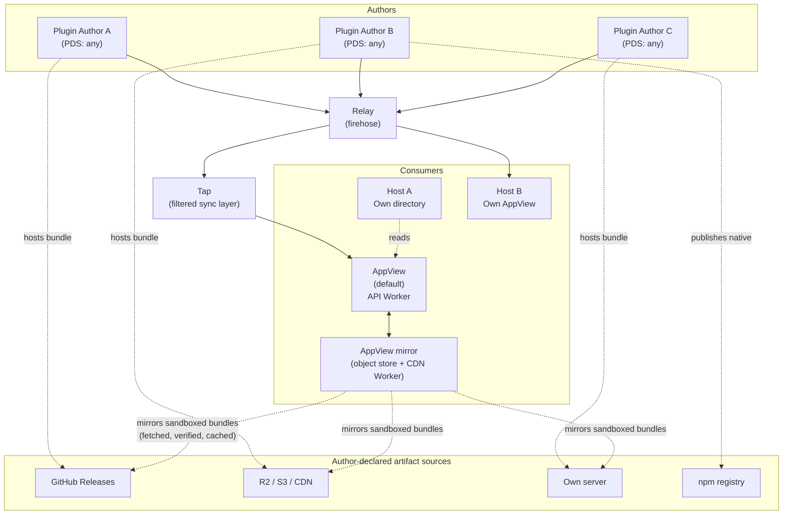
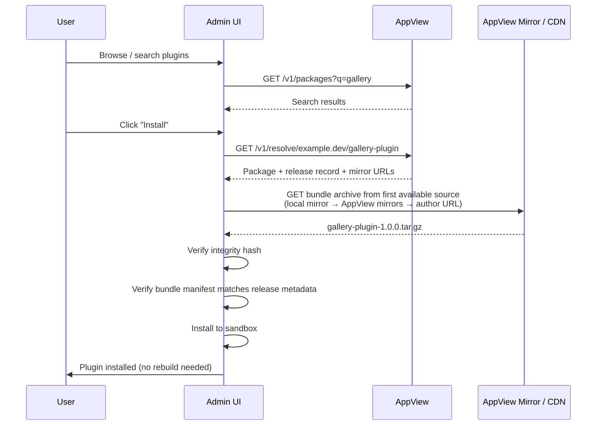
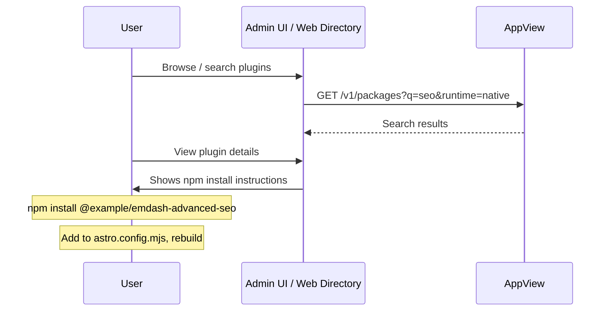
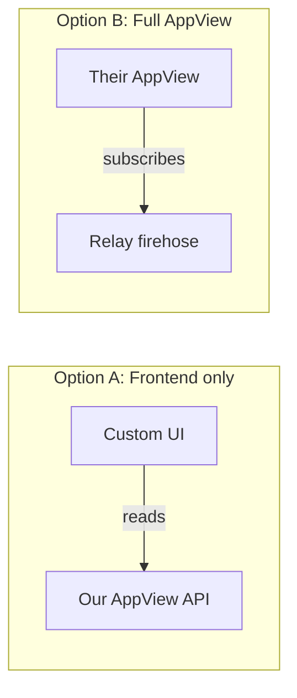

# RFC: Decentralized Plugin Registry

# Summary

A decentralized plugin registry for EmDash where authors publish package metadata as records in their own AT Protocol repositories. An AppView indexes these records from the network firehose to provide search and discovery. Sandboxed plugin bundles (`.tar.gz` archives) are hosted by the author wherever they choose. Anyone can participate — as an author, a directory host, or a mirror — without permission from a central authority.

The registry supports both of EmDash's plugin types: **sandboxed** plugins that run in isolated Worker sandboxes and can be installed at runtime, and **native** plugins that are npm packages integrated into the Astro build pipeline with full platform access.

# Example

A plugin author with an existing Atmosphere account publishes a sandboxed plugin:

```bash
# Authenticate with your Atmosphere account
$ emdash plugin login
# Opens OAuth flow in browser, stores credentials locally

# Scaffold a new plugin project
$ emdash plugin init
# Creates a plugin.json manifest with prompts for name, description, etc.

# Publish a release with an already-hosted artifact
$ emdash plugin publish --url https://github.com/example/gallery/releases/download/v1.0.0/gallery-plugin-1.0.0.tar.gz
# Fetches the bundle to compute the hash, creates the package record on first publish,
# then creates a release record pointing to the URL
```

Or a native plugin, distributed via npm:

```bash
# Scaffold a native plugin project
$ emdash plugin init --type native
# Creates a plugin.json manifest with the npm package name recorded as a publish hint

# Publish a release that references an npm version
$ emdash plugin publish --npm @example/emdash-advanced-seo@1.0.0
# Verifies the npm package.json contains a matching DID, captures the npm integrity hash,
# and creates a release record with source=#npmSource and runtime=#nativeRuntime
```

A CMS user installs either type:

- **Sandboxed plugins** are installed from the admin UI. The admin searches the registry, picks a plugin, and installs it with one click — no CLI, no rebuild.
- **Native plugins** are discovered through the registry (admin UI or web directory), then installed via `npm install` and added to the Astro config. The registry tells you what to install; npm handles the installation.

The package record is stored in the author's own atproto repository, signed by their keys, and indexed by the AppView for discovery.

# Background & Motivation

Centralised plugin registries create single points of failure, control and trust. When one organisation controls the registry, they control the supply chain. We've seen this play out repeatedly:

- The WordPress ecosystem's dependency on WordPress.org and the governance disputes that led to FAIR.
- npm's `left-pad` incident, where a single package removal broke thousands of builds.
- RubyGems, PyPI and other registries where a compromised account can push malicious updates to thousands of consumers.

In all of these cases, the root problem is the same: a central registry that conflates identity, hosting, discovery and trust into a single service under a single operator's control.

We want a plugin ecosystem where:

- Authors own their identity and their package metadata. It lives in their own repository, signed by their own keys, and is portable if they move providers.
- Anyone can host artifacts. There is no requirement to upload to a blessed server.
- Anyone can run a directory. Multiple competing directories can index the same package data with different curation, moderation and presentation.
- No single point of failure. If the primary AppView goes down, plugins can still be resolved directly from the author's Personal Data Server.

The AT Protocol gives us identity, cryptographic signing, data portability and a global event stream as existing infrastructure. Rather than building all of this from scratch, we build a thin application layer on top.

# Goals

- **Zero-infrastructure publishing.** A plugin author needs only an Atmosphere account (e.g. a Bluesky or npmx account) and optionally a URL where they host their bundle artifact.
- **Decentralised discovery.** An AppView indexes package records from the atproto firehose. Anyone can run their own AppView to build competing directories.
- **Cryptographic integrity.** Every package record is signed as part of the author's atproto repository. SRI integrity hashes in signed release records provide transitive verification of downloads.
- **Portability.** Authors can migrate their Atmosphere account between providers without losing their packages. Their DID stays the same, their records come with them.
- **Low barrier for hosts and third parties.** A hosting provider should be able to offer a plugin directory with minimal effort, using a client library and an API rather than a fully bespoke registry stack.
- **Unified ecosystem.** A single registry and discovery mechanism for both sandboxed and native plugins, with the install flow adapting to the plugin type.
- **Replace the existing centralised marketplace.** This RFC is not additive — it fully replaces EmDash's current marketplace mechanism in a single rollout. The existing `_plugin_state` rows with `source='marketplace'` and `marketplace_version` are migrated to reference the new canonical `did/slug` identity during Phase 1. See [For existing marketplace installs](#for-existing-marketplace-installs).

# Non-Goals

- **Replacing atproto infrastructure.** We do not build or run a PDS, relay, or DID directory. We use existing infrastructure.
- **Mandating a specific artifact host.** Authors choose where to host their bundle artifacts. The initial design assumes a published artifact URL.
- **Trust and moderation primitives in v1.** Reviews, reports, labellers and other social or moderation features are planned, but will be specified in later RFCs.
- **Supporting private/authenticated packages in the initial version.** Paid and private plugins are a future extension. The initial design focuses on public, open-source packages.
- **Wire-level FAIR compatibility in v1.** FAIR's HTTP repository API and this proposal's atproto-records-as-transport are different publishing surfaces, and we are not specifying a bridge between them in v1. Cross-protocol interop is tracked as an open question; see [Unresolved Questions](#unresolved-questions).
- **Inter-plugin dependency resolution in v1.** Per-plugin dependency and peer declarations are deferred to a follow-on RFC. A narrow host-compatibility field (`compatibility.emdash`, a semver range on the EmDash runtime) is included in v1.
- **Replacing npm for native plugins.** The registry provides discovery, identity and metadata for native plugins, but npm remains the distribution mechanism. We don't reimplement package management.

# Prior Art

## FAIR Package Manager

[FAIR](https://fair.pm/) (Federated And Independent Repositories) is a decentralised package manager originating in the WordPress ecosystem and supported by the Linux Foundation. It uses W3C DIDs (both `did:web` and `did:plc`) as package identifiers and defines an HTTP-level repository API that can be served from a dedicated server or a static host such as GitHub.

FAIR validates the general approach of decentralised package identity. EmDash differs principally in how metadata moves through the network:

|                       | FAIR                                                                                           | This proposal                                                                                |
| --------------------- | ---------------------------------------------------------------------------------------------- | -------------------------------------------------------------------------------------------- |
| Identity model        | One DID per package; publisher keys registered on the package DID document                     | One DID per author, multiple packages per account                                            |
| Metadata transport    | HTTP repository API, servable from any static host                                             | atproto records in the author's repo, distributed via the firehose                           |
| Author infrastructure | Any host that can serve the repository API; CLI tooling automates setup                        | An Atmosphere account (hosted or self-hosted PDS)                                            |
| Discovery             | Aggregators (e.g. AspireCloud) index known repositories                                        | AppView subscribes to the relay firehose                                                     |
| Signing               | Publisher signing keys registered as verification methods on the DID document                  | Repo-level signing (records are signed as part of the MST)                                   |
| Ratings, reviews, etc | Not in the base protocol; addressed via the labeller layer                                     | Deferred to follow-on RFCs, also via a labeller layer                                        |
| Artifact hosting      | Served from the repository host                                                                | Author hosts the artifact anywhere; URL + SRI integrity in release record                    |
| Trust model           | Light base protocol; code scanning and gating live in labellers with a site-side policy engine | Same pattern: permissive protocol, labeller-attached trust signals, site-decided enforcement |

## npm, crates.io, PyPI

Traditional centralised registries. Authors publish to a single server that handles storage, discovery, identity and trust. The model works well at scale but concentrates control and creates supply chain risk. Our design separates these concerns across independent infrastructure.

## Prior discussions in this repo

This RFC has two direct antecedents in EmDash's own community discussions:

- **[#307](https://github.com/emdash-cms/emdash/discussions/307)** by @erlend-sh introduced FAIR as a model for decentralised package management for EmDash, and noted the shared use of DIDs as a point of overlap between FAIR and the atproto stack EmDash was already planning to use. That overlap is what led to this proposal's architecture: rather than adopt FAIR's HTTP repository model, we use atproto records directly as the transport, because the identity, signing and event-stream primitives are already there.

- **[#296](https://github.com/emdash-cms/emdash/discussions/296#discussioncomment-16534494)** by @BenjaminPrice laid out a decentralised marketplace design whose trust model this RFC adopts and extends. Specific elements carried forward from #296:
  - The framing that _the sandbox proves safety, signing proves provenance_ — the basis of the Security Model in this RFC, and the reason we do not require deep code inspection or mandatory security gates.
  - Surfacing declared capabilities and allowed hosts to the installing admin as informed consent, rather than treating the capability manifest as an internal implementation detail.
  - Author-hosted artifacts verified by a signed integrity hash, rather than a central artifact store.
  - A multi-party directory ecosystem where third parties can run their own indexers and front-ends on top of the same underlying records.
  - Optional SBOM metadata on releases, for CRA readiness.
  - Local mirrors as a resolution step before the AppView, for offline and air-gapped installs.
  - Reserving site identity (via `did:web` derived from the site's domain) as the mechanism for signed install and review records in a follow-on RFC.

This RFC narrows the scope, and diverges on two substantive points, both called out inline where they apply: it uses atproto's repo-level MST signing rather than explicit per-publisher ED25519 keypairs, and it uses the atproto firehose plus an AppView pattern rather than a per-site array of aggregator URLs. The follow-on RFCs for reviews, labels and moderation build directly on the groundwork in #296.

# Detailed Design

## AT Protocol Primer

This proposal builds on the [AT Protocol](https://atproto.com/guides/overview) ("atproto"), the decentralised social publishing protocol originally developed at Twitter. It now primarily used to power the social network Bluesky, which also leads protocol development. It is also used for third-party services such as [Tangled](https://tangled.org/) (Git hosting), [Leaflet](https://leaflet.pub) (blogging) and [Streamplace](https://stream.place/) (live streaming). Here are the key concepts used throughout this document:

- **[Atmosphere account](https://atmosphereaccount.com/)** — A portable digital identity on the AT Protocol network. One account works across all Atmosphere apps (Bluesky, Tangled, Leaflet, etc.) and is hosted by a provider the user chooses — an app like Bluesky, an independent host, or self-hosted infrastructure. The account can move between providers without losing data or identity. When this document refers to an "Atmosphere account", it means any account on an AT Protocol-compatible host.

- **[DID](https://atproto.com/specs/did)** (Decentralized Identifier) — A permanent, globally unique identifier for an account (e.g. `did:plc:ewvi7nxzyoun6zhxrhs64oiz`). Defined as a W3C standard. DIDs resolve to documents containing the account's cryptographic keys and hosting location. Think of them like a portable UUID that also tells you where to find the account's data. FAIR also uses DIDs as package identifiers.

- **[Handle](https://atproto.com/specs/handle)** — A human-readable domain name mapped to a DID (e.g. `cloudflare.social` or `jay.bsky.team`). Domain ownership is verified via DNS or `.well-known` files. Handles are mutable — you can change yours — but your DID stays the same.

- **[PDS](https://atproto.com/guides/overview#personal-data-server-pds)** (Personal Data Server) — The server that hosts a user's data, and where a user signs up for an account. Bluesky runs PDSs for its users, but anyone can run their own and they are all interoprable. Other services that provide PDSs include [npmx](https://npmx.social), [Blacksky](https://blackskyweb.xyz/) and [Eurosky](https://eurosky.tech/). [Cirrus](https://github.com/ascorbic/cirrus/) lets you self-host a PDS in a Cloudflare Worker. If your PDS disappears, you can migrate to a new one because your identity is rooted in your DID, not in the server.

- **[Repository](https://atproto.com/specs/repository)** — A user's public dataset, stored as a signed Merkle Search Tree (MST) in their PDS. Every record in a repo is covered by the tree's cryptographic signature, so you can verify that any record really was published by the account's owner.

- **[Lexicon](https://atproto.com/specs/lexicon)** — A schema language for describing record types and APIs, similar to JSON Schema. Applications define lexicons to declare the shape of data they read and write. Lexicons are identified by NSIDs (Namespaced Identifiers) in reverse-DNS format, e.g. `site.standard.document` or `app.bsky.feed.post`.

- **[AT URI](https://atproto.com/specs/at-uri-scheme)** — A URI scheme for referencing specific records: `at://<did>/<collection>/<rkey>`. For example, `at://did:plc:abc123/example.packages.record/gallery-plugin`.

- **[Relay and Firehose](https://atproto.com/specs/sync)** — Relays aggregate data from many PDSes into a single event stream (the "firehose"). Any service can subscribe to the firehose to receive real-time notifications of record creates, updates and deletes across the entire network. Bluesky operates public relay infrastructure, and third-party relays exist as well.

- **[AppView](https://atproto.com/guides/overview)** — A service that subscribes to the firehose, indexes records it cares about, and serves an API for clients. Think of it like a specialised search engine and API for a particular type of atproto data. Unlike most other atproto services, the AppView is not generic, and is generally custom-built for a particular service where it implements the business logic of that app. Bluesky runs one AppView, as do third-party services such as [Leaflet](https://leaflet.pub/) or [Streamplace](https://stream.place/).

- **[Labeller](https://atproto.com/specs/label)** — A service that publishes signed labels about records or accounts (e.g. "verified", "spam", "nsfw"). Labels are a lightweight moderation primitive that can be consumed by AppViews and clients.

## Plugin Types

EmDash supports two types of plugin with fundamentally different runtime and distribution models. The registry handles both, but the install flow differs.

### Sandboxed plugins

Sandboxed plugins run in isolated sandboxes. The default sandbox is implemented via Cloudflare Dynamic Workers. Their bundle manifest declares exactly what resources they can access, including capabilities such as `read:content` and `email:send`. They can be installed at runtime from the admin UI — no CLI, no build step, no restart required.

```js
export default () =>
	definePlugin({
		id: "notify-on-publish",
		capabilities: ["read:content", "email:send"],
		hooks: {
			"content:afterSave": async (event, ctx) => {
				/* ... */
			},
		},
	});
```

For these plugins, the registry is the **complete distribution channel**: discovery → download → verify → install, all automated.

### Native plugins

Native plugins are npm packages that integrate into the Astro build pipeline. They have full access to the Node.js runtime and can provide Astro components, API routes, middleware, custom block types — anything. Installation requires `npm install`, a config change, and a rebuild/redeploy.

> **Terminology note.** "Native plugin" is the new canonical term for what EmDash has historically called a "trusted plugin" in code comments, documentation and error messages (e.g. "this hook is trusted-only"). Alongside this RFC, the codebase is being updated so that user-facing terminology consistently uses "native"; "trusted" remains useful internally to describe the runtime trust level a native plugin runs with, but is no longer the name of the plugin type.

```js
// astro.config.mjs
import formPlugin from "@example/emdash-advanced-forms";
export default defineConfig({
	integrations: [emdash({ plugins: [formPlugin()] })],
});
```

For these plugins, the registry is a **discovery and metadata layer**. It adds value over npm alone because:

- The author's identity is atproto-verified, not just an npm username.
- The registry knows it's an EmDash plugin specifically (npm doesn't).
- Users get a unified directory for the whole EmDash ecosystem.

npm remains the distribution mechanism for native plugins. The registry does not attempt to replace it.

#### The native-plugin escape-hatch tension

Listing native plugins in the same registry as sandboxed ones has a real tension worth naming. The pitch for EmDash's sandbox is that plugins ship with enforced, declared capabilities — users can install without reading source, because the sandbox prevents anything the plugin didn't explicitly ask for. Native plugins don't offer that guarantee: they run with full platform privileges. Listing both types side by side with roughly equal prominence risks users installing native plugins the same way they'd install sandboxed ones, treating the two as interchangeable when they're very much not.

This RFC accepts that tradeoff because the install friction is already very different — a sandboxed plugin is one click from the admin UI, while a native plugin requires an `npm install`, an `astro.config.mjs` edit and a rebuild. That gap is a non-trivial signal on its own. The UI should lean into it, not try to erase it. Specifically:

- **Primary discovery surfaces should default to sandboxed-only** and require an explicit opt-in or separate tab to show native plugins. "I want to install something right now" is a different flow from "I'm looking at native integrations I might adopt."
- **Native-plugin install instructions must include the trust framing.** Not a warning banner, but a clear statement that the plugin runs with full platform access and is not subject to sandbox enforcement. Informed consent, same principle as capability listings for sandboxed plugins.
- **Managed-host clients may choose to hide native plugins entirely** from their directory. The protocol does not mandate that either plugin type be surfaced; a client is free to show only the variants it can install safely on its platform.

The combination of capability-declared sandboxed plugins plus clearly-gated native plugins is intended to give platforms a choice: expose both with appropriate UX differentiation, or expose only the runtime tier they can reasonably support. Pretending native plugins don't exist would push authors towards the alternative — unlisted npm packages discovered through word of mouth — which has worse trust properties than a registry-indexed listing with explicit framing.

## Architecture Overview



**Authors** publish `package` and `release` records to their own PDS via standard atproto APIs. EmDash will provide a CLI command to do this, so users don't need to use the APIs directly. For sandboxed plugins, they host bundle tarballs wherever they choose. For native plugins, they publish to npm as usual.

**The relay** broadcasts all record operations via the firehose. This is existing atproto infrastructure — we do not run it.

**AppViews** subscribe to the firehose, filter for our lexicon namespace, and build a searchable index. We run the default AppView and publish an open source reference implementation. Anyone else can run their own.

**EmDash clients** built-in to the dashboard, these query an AppView for discovery, but can also resolve packages directly from an author's PDS. This means the system degrades gracefully — if the AppView is down, known packages can still be installed.

## Lexicons

> **Namespace placeholder.** This draft uses `example.packages.*` for the shared package/registry records and `com.emdashcms.plugin.*` for EmDash-specific runtime extensions. The `example.*` namespace is a deliberate placeholder — the intended shape is a reverse-DNS namespace on a domain that signals shared infrastructure rather than single-project ownership (e.g. something under a `community.*` or `.community` TLD), following the precedent of `community.lexicon.*`. The concrete namespace will be decided before the lexicons are published; until then, treat every `example.packages.*` NSID in this document as "the eventual shared-infrastructure namespace, whatever it ends up being called."

The namespace split has two layers:

- **`example.packages.*`** — identity, artifacts, signing, mirrors, source variants, integrity. Intentionally host-neutral so other hosts can publish compatible records.
- **`com.emdashcms.plugin.*`** — EmDash-specific runtime semantics (capabilities, sandbox runtime, native-runtime hints, compatibility). Attached to release records via an open `runtime` union.

Another host (a hypothetical "Foo CMS" adopting the same identity layer) would add `com.foocms.plugin.*` runtime variants the same way. That interop is intentional but out of scope for v1 — EmDash is the only host this RFC specifies.

### `example.packages.record`

Describes a package. Stored in the author's repo with the slug as the record key, producing human-readable AT URIs like:

```
at://did:plc:abc123/example.packages.record/gallery-plugin
```

Or, using a handle:

```
at://example.dev/example.packages.record/gallery-plugin
```

**Schema:**

| Property      | Type              | Required | Description                                                                                                                                                                                                                     |
| ------------- | ----------------- | -------- | ------------------------------------------------------------------------------------------------------------------------------------------------------------------------------------------------------------------------------- |
| `slug`        | string            | yes      | URL-safe package slug, matching the record key. Combined with the author DID, it forms the canonical package identity `did/slug`. `[a-z][a-z0-9\-_]*`, max 64 chars.                                                            |
| `name`        | string            | yes      | Human-readable package name. Max 200 chars.                                                                                                                                                                                     |
| `description` | string            | yes      | Short package description. Max 500 chars.                                                                                                                                                                                       |
| `license`     | string            | yes      | SPDX licence expression, or `"proprietary"`.                                                                                                                                                                                    |
| `authors`     | Author[]          | yes      | At least one author.                                                                                                                                                                                                            |
| `homepage`    | string (uri)      | no       | URL to project homepage (docs site, marketing page, etc.).                                                                                                                                                                      |
| `repository`  | Repository        | no       | Source code repository. Used by tooling for "view source", "file an issue", and provenance cross-checks.                                                                                                                        |
| `keywords`    | string[]          | no       | Search keywords. Max 10 items.                                                                                                                                                                                                  |
| `icon`        | blob              | no       | Package icon. PNG, max 1 MiB, recommended 256×256. Displayed in listings and detail pages; clients can fetch it from the author's PDS without downloading any release artifact.                                                 |
| `screenshots` | Screenshot[]      | no       | Up to 5 screenshots. Each screenshot bundles an image blob with an optional caption. Stored on the package record, not inside the release tarball, so directory clients can display them without fetching the artifact.         |
| `readme`      | blob              | no       | Long-form description. `text/markdown`, max 256 KiB. Stored as a blob rather than an inline string so the record stays small and the README can be updated independently without rewriting the package record.                  |
| `security`    | string (uri)      | no       | URL to a security policy (e.g. a `.well-known/security.txt` or a vendor-specific disclosure page). A single URL is intentional — aligns with `security.txt` conventions and avoids duplicating what the link already describes. |
| `deprecated`  | Deprecation       | no       | Marks the package as deprecated. Authors set this to direct installs elsewhere; clients should display the deprecation notice and, where possible, suggest the replacement package.                                             |
| `createdAt`   | string (datetime) | yes      | ISO 8601 creation timestamp.                                                                                                                                                                                                    |

Neither a "plugin type" (sandboxed vs native) nor an npm package name appears on the package record. Both are properties of how a specific _release_ is distributed and executed, and both live on the release record (see [`example.packages.release`](#examplepackagesrelease)). In practice a package's releases will all share one runtime variant, but making that a per-release declaration is what keeps the package record host-neutral.

**Package identity:**

- The canonical package identity is `did/slug`.
- The canonical record reference is the package record's AT URI, for example `at://did:plc:abc123/example.packages.record/gallery-plugin`.
- EmDash implementations may derive a local runtime key from `did/slug` for storage, routing or namespacing. That encoding is implementation-defined, but it must remain stable for a given package identity.
- Handles are mutable by design. An author changing their handle from `example.dev` to `example.bsky.social` does not affect canonical identity — the `did` stays the same and so does the package. Clients should re-resolve handles each time they display a package, rather than caching the handle string.

**Display and trust:**

The registry protocol is intentionally permissive about what records an author can publish: any DID can publish a package record with any slug. This means nothing at the record level prevents impersonation — `did:plc:anyone/emdash-official-whatever` is a publishable record. The UI, not the protocol, is where trust is established.

- **DIDs are never user-facing.** Admins see `did:plc:abc...` only in developer contexts (e.g. copy-paste of an AT URI). The admin UI renders a package using its human-readable fields.
- **Slugs are not a trust signal on their own.** The slug is whatever the author chose. Two packages with the same slug under different DIDs are distinct, and neither has a claim on the name.
- **Primary display is `name` attributed to `@handle`.** For example, "Gallery Plugin · by @example.dev". The record's `name` field is what the author calls it; the handle is what ties it to an identity. Slugs surface in URLs, CLI invocations and disambiguation, not as the primary label.
- **Verification is label-driven (follow-on RFC).** In a future RFC we introduce trusted-labeller support modelled on Bluesky's verification labels. A labeller account signs `verified` (or similar) labels on package AT URIs; clients configured to trust that labeller render a badge. This is the mechanism for "this is the real EmDash-team-published plugin" — we deliberately do not bake it into the registry protocol itself. Until that lands, the admin UI should treat all packages equally and surface the author's handle prominently so users can make their own judgment.

**Runtime plugin identity:**

This RFC introduces `did/slug` as a new canonical registry identity. It is layered on top of the runtime plugin ID that already exists inside EmDash today — the two coexist, and the runtime plugin ID keeps its current meaning:

- The runtime plugin ID is what EmDash uses internally for storage namespacing, hook registration, capability enforcement and route mounting. It comes from `manifest.json`'s `id` for sandboxed plugins, and from the exported plugin descriptor's `id` for native plugins. This has not changed.
- `did/slug` is introduced by this RFC. It is the canonical identity for a package in the registry. It is what the admin UI resolves, what the AppView indexes, and what an AT URI dereferences.
- The two identifiers are independent. An author may set `manifest.id` equal to their registry slug, but they are not required to — a plugin can be renamed inside EmDash without republishing, and a registry slug can differ from the runtime ID used in the code.
- The runtime plugin ID must remain stable across releases of the same package. Changing it mid-life would orphan installed data.
- EmDash persists a mapping from `did/slug` (and its AT URI) to the runtime plugin ID at install time, so that registry records can be reconciled against locally-installed plugins and update checks can be performed.

**Package mutability:**

- `slug` is immutable.
- Runtime changes for a package — e.g. releases switching from sandboxed to native — are technically possible because the package record no longer carries a `type` field, but are strongly discouraged. In practice, existing installs of a package cannot cleanly migrate across runtime variants (the storage, host access and capability models differ), so a "runtime migration" should be modelled as deprecating the old package and publishing a new one that the `deprecated.replacement` field points at. Clients should flag abrupt runtime changes in an existing package's release history as suspicious.

**Package validation rules:**

- There is no cross-field validation on the package record beyond the per-field rules in the schema table. All runtime-type-specific validation (npm package names, capability strings, etc.) lives on the release record.

**Author object:**

| Property | Type         | Required |
| -------- | ------------ | -------- |
| `name`   | string       | yes      |
| `url`    | string (uri) | no       |
| `email`  | string       | no       |

**Repository object:**

| Property    | Type         | Required | Description                                                                                                        |
| ----------- | ------------ | -------- | ------------------------------------------------------------------------------------------------------------------ |
| `type`      | string       | yes      | Repository type. Typically `"git"`.                                                                                |
| `url`       | string (uri) | yes      | Clone or browse URL (e.g. `https://github.com/example/emdash-gallery`, `https://tangled.sh/@example.dev/gallery`). |
| `directory` | string       | no       | Subpath within the repo, for monorepos (e.g. `packages/gallery`).                                                  |

**Screenshot object:**

| Property  | Type   | Required | Description                                                             |
| --------- | ------ | -------- | ----------------------------------------------------------------------- |
| `image`   | blob   | yes      | Image blob. `image/png`, `image/jpeg`, or `image/webp`. Max 2 MiB each. |
| `caption` | string | no       | Alt text / caption for the screenshot. Max 200 chars.                   |

**Deprecation object:**

| Property       | Type              | Required | Description                                                                                                                                            |
| -------------- | ----------------- | -------- | ------------------------------------------------------------------------------------------------------------------------------------------------------ |
| `reason`       | string            | yes      | Short human-readable reason. Max 500 chars. Displayed to users considering installing.                                                                 |
| `replacement`  | string (at-uri)   | no       | AT URI of a replacement package (e.g. `at://did:plc:xyz/example.packages.record/gallery-v2`). May live under a different DID if ownership transferred. |
| `deprecatedAt` | string (datetime) | no       | When the package was marked deprecated. Defaults to record update time.                                                                                |

Setting `deprecated` is a one-way move at the UX level: once a client sees a deprecated package, it surfaces the deprecation prominently on install. Authors can technically remove the field from the record, but tooling should warn against it — deprecations are usually set in response to security or ownership events, and un-deprecating quietly is a vector for confusing users. This is policy, not protocol: the lexicon allows the field to be removed, but the reference CLI refuses.

### `example.packages.release`

Describes a release of a package. The record key is auto-generated (a [TID](https://atproto.com/specs/record-key)).

The release record separates two concerns that have historically been fused in package registries:

- **Source** — _how_ the client retrieves the bytes. A tarball at some URL, an npm package name, or any future form. Described by the `source` field, an open union of source variants defined in `example.packages.defs`.
- **Runtime** — _what_ the bytes are for and how the host runs them. For EmDash that's the sandboxed runtime (capability-gated, installed at runtime) or the native runtime (full-privilege Astro integration, installed via the build pipeline). Described by the `runtime` field, an open union populated by host-specific lexicons.

Keeping these orthogonal means adding a new distribution channel (e.g. OCI images, or a private CDN protocol) doesn't require a new trust/runtime decision, and adding a new runtime tier (e.g. a reviewed-native tier) doesn't force a distribution decision. The two v1 combinations (tarball + sandboxed, npm + native) map exactly to today's supported shapes; other combinations are allowed by the lexicon but rejected by v1 publish and install policy (see [Release validation rules](#release-validation-rules)).

**Schema:**

| Property    | Type              | Required | Description                                                                                                                                                                                                                                                                                                                                                                                                                                                                                                                                                                     |
| ----------- | ----------------- | -------- | ------------------------------------------------------------------------------------------------------------------------------------------------------------------------------------------------------------------------------------------------------------------------------------------------------------------------------------------------------------------------------------------------------------------------------------------------------------------------------------------------------------------------------------------------------------------------------- |
| `package`   | string (at-uri)   | yes      | AT URI of the package record this release belongs to.                                                                                                                                                                                                                                                                                                                                                                                                                                                                                                                           |
| `version`   | string            | yes      | Semver version string.                                                                                                                                                                                                                                                                                                                                                                                                                                                                                                                                                          |
| `integrity` | string            | yes      | [Subresource Integrity](https://developer.mozilla.org/en-US/docs/Web/Security/Subresource_Integrity) hash of the release artifact, in SRI format (`<algo>-<base64>`, e.g. `"sha256-abc..."`, `"sha512-abc..."`). Algorithm must be `sha256`, `sha384`, or `sha512`. Always computed over the bytes that `source` identifies — for `#tarballSource` this is the `.tar.gz`; for `#npmSource` it is the tarball npm serves for the given name and version. Because the release record is signed as part of the author's atproto repo MST, this hash is transitively authenticated. |
| `source`    | union             | yes      | How to retrieve the release artifact. Open union of source variants defined in `example.packages.defs` — v1 ships `#tarballSource` and `#npmSource`. See [Source variants](#source-variants).                                                                                                                                                                                                                                                                                                                                                                                   |
| `runtime`   | union             | no       | How the host runs this release. Open union of runtime variants defined by each host — EmDash contributes `com.emdashcms.plugin.runtime#sandboxedRuntime` and `#nativeRuntime`. A release without a `runtime` is valid at the protocol layer (it is "some artifact somewhere" — potentially interesting to a generic directory) but is not installable by EmDash. See [Runtime variants](#runtime-variants).                                                                                                                                                                     |
| `sbom`      | Sbom              | no       | Reference to a software bill of materials for this release.                                                                                                                                                                                                                                                                                                                                                                                                                                                                                                                     |
| `changelog` | blob              | no       | Release notes. `text/markdown` blob, max 64 KiB. A blob (rather than an inline string) so the release record itself stays small and changelogs can be fetched independently.                                                                                                                                                                                                                                                                                                                                                                                                    |
| `yanked`    | Yanked            | no       | Marks the release as yanked — still resolvable by AT URI, still installable by a client that explicitly selects this exact version, but excluded from latest-release selection and discovery. Distinct from record deletion: deletion removes the release entirely; yanking keeps it as history but pushes the "latest" pointer to a different version.                                                                                                                                                                                                                         |
| `createdAt` | string (datetime) | yes      | ISO 8601 creation timestamp.                                                                                                                                                                                                                                                                                                                                                                                                                                                                                                                                                    |

**Sbom object:**

| Property    | Type         | Required | Description                                                                                                                                        |
| ----------- | ------------ | -------- | -------------------------------------------------------------------------------------------------------------------------------------------------- |
| `format`    | string       | yes      | SBOM format identifier. `"cyclonedx"` or `"spdx"`.                                                                                                 |
| `url`       | string (uri) | yes      | URL where the SBOM document can be fetched.                                                                                                        |
| `integrity` | string       | yes      | SRI integrity hash of the SBOM document (same format rules as the release `integrity` field), so it is transitively signed via the release record. |

**Yanked object:**

| Property   | Type              | Required | Description                                                                                                |
| ---------- | ----------------- | -------- | ---------------------------------------------------------------------------------------------------------- |
| `reason`   | string            | yes      | One of `"security"`, `"defect"`, `"author_request"`, `"other"` (open enum via `knownValues`).              |
| `message`  | string            | no       | Human-readable explanation. Max 500 chars. Displayed to operators who already have this version installed. |
| `yankedAt` | string (datetime) | no       | When the release was yanked. Defaults to record update time if absent.                                     |

#### Source variants

Source variants live in `example.packages.defs` and are referenced from the release record's `source` field. The union is open (`closed: false`): unknown source types parse successfully and are simply skipped by clients that don't understand them, so a future `#ociSource` or `#gitSource` lands additively.

**`example.packages.defs#tarballSource`** — the artifact is a gzipped tar archive served over HTTPS.

| Property | Type     | Required | Description                                                                                                                                                                                                                                        |
| -------- | -------- | -------- | -------------------------------------------------------------------------------------------------------------------------------------------------------------------------------------------------------------------------------------------------- |
| `urls`   | string[] | yes      | Ordered list of URLs where the artifact can be retrieved. At least one. First entry is the author's canonical location; later entries are author-declared alternates (e.g. a CDN). Clients try them in order and re-verify integrity against each. |

**`example.packages.defs#npmSource`** — the artifact is an npm package tarball addressed by name and version.

| Property  | Type   | Required | Description                                               |
| --------- | ------ | -------- | --------------------------------------------------------- |
| `package` | string | yes      | npm package name (e.g. `"@example/emdash-advanced-seo"`). |
| `version` | string | yes      | Exact npm version (e.g. `"1.0.0"`). No ranges.            |

#### Runtime variants

Runtime variants are host-specific. EmDash defines them in `com.emdashcms.plugin.runtime`; another host (e.g. a hypothetical Foo CMS) would define its own under `com.foocms.plugin.runtime` and publish releases using those variants in the same `runtime` union slot.

**`com.emdashcms.plugin.runtime#sandboxedRuntime`** — capability-gated runtime installed at runtime into EmDash's sandbox.

| Property        | Type          | Required | Description                                                                                                                                        |
| --------------- | ------------- | -------- | -------------------------------------------------------------------------------------------------------------------------------------------------- |
| `capabilities`  | string[]      | yes      | Declared capabilities (e.g. `"read:content"`, `"email:send"`). At least one. Must match the capabilities declared in the bundle's `manifest.json`. |
| `allowedHosts`  | string[]      | no       | Allowed outbound host patterns. Omission means no outbound host access. Must match the bundle manifest.                                            |
| `compatibility` | Compatibility | no       | Host-version constraint (see below).                                                                                                               |

**`com.emdashcms.plugin.runtime#nativeRuntime`** — native Astro integration runtime, installed via the build pipeline.

| Property        | Type          | Required | Description                                                                   |
| --------------- | ------------- | -------- | ----------------------------------------------------------------------------- |
| `compatibility` | Compatibility | no       | Host-version constraint (see below). May include `astro` as well as `emdash`. |

**Compatibility object** (reused by both runtime variants):

| Property | Type   | Required | Description                                                                                                                                                                                                                  |
| -------- | ------ | -------- | ---------------------------------------------------------------------------------------------------------------------------------------------------------------------------------------------------------------------------- |
| `emdash` | string | no       | A semver range (e.g. `">=2.0.0 <3"`, `"^2.4.0"`) the EmDash runtime must satisfy. If present, clients on a version outside the range must refuse to install the release. If omitted, no host-version constraint is declared. |

`compatibility` is intentionally narrow in v1: only the host runtime version. Per-plugin dependencies, peer declarations and capability negotiation between plugins are deferred to the follow-on dependency-metadata RFC. New sub-keys (e.g. `node`, individual plugin peer ranges) will be added there as optional properties on this object.

#### Release validation rules

- Every release `version` must be valid semver.
- Within a package, `version` must be unique across non-deleted, non-yanked release records. If two records claim the same version, the record with the earliest `createdAt` wins and later records are treated as invalid duplicates — they must be ignored by the AppView and rejected by install clients. This prevents a compromised account from silently overriding a clean prior release.
- Every release must include `integrity`, in SRI format, using `sha256`, `sha384` or `sha512`.
- Every release must include a `source`. A release without a source is not installable and must be rejected at publish and ingest.
- `runtime` is optional at the protocol layer. EmDash clients refuse to install a release without a known `runtime` variant — the release is indexable metadata, but not actionable.
- **v1 allowed combinations:** `#tarballSource` × `#sandboxedRuntime`, and `#npmSource` × `#nativeRuntime`. Any other source/runtime combination is rejected by the reference publish CLI and by EmDash install clients. This is v1 policy, not protocol — the lexicons permit other combinations, and lifting these restrictions in a later RFC does not invalidate any existing records.
- **Tarball-sourced releases:** the archive must be a valid gzipped tar, must be no larger than 50 MB, and must hash to the release's `integrity`. The CLI refuses to publish, and the default AppView refuses to mirror, any release exceeding the size cap.
- **Sandboxed-runtime releases:** the bundle manifest's `capabilities` and `allowedHosts` must match the runtime variant's corresponding fields. This is checked at publish time by the CLI and at install time by the client.
- **npm-sourced releases:** the CLI refuses to publish if npm's metadata does not include a modern `dist.integrity` — legacy packages with only `shasum` (SHA-1) must republish with modern packaging before they can be listed in the registry.
- `sbom` is optional. Consumption and labelling of SBOM data is out of scope for v1 and deferred to the follow-on trust RFC.
- When `compatibility.emdash` is present, it must parse as a valid semver range. Clients must refuse to install a release whose declared range is not satisfied by their own EmDash runtime version, and the error must name the constraint and the running version.

**Sandboxed bundle format:**

The full bundle format is specified separately as part of the sandboxed plugin runtime spec. For registry purposes, the only requirements the registry protocol imposes are:

- A sandboxed release artifact is a gzipped tar archive (`.tar.gz`).
- The archive root must contain `manifest.json` and `backend.js`.
- The archive root may contain `admin.js` and `README.md`. Icons and screenshots are _not_ bundled in the tarball — they live as blobs on the package record, so directory clients can display them without downloading any artifact.
- The `.tar.gz` must be no larger than 50 MB. The CLI refuses to publish, and the default AppView refuses to mirror, any release exceeding this limit.
- The release `integrity` hash is computed over the exact `.tar.gz` bytes served at the source's URL.
- The manifest's `capabilities` and `allowedHosts` must match the corresponding fields in the release's `runtime` variant. This is the only part of the manifest the registry validates at install time — everything else (runtime plugin ID, storage declarations, hook declarations, route declarations, admin metadata) is opaque to the registry and is validated by the EmDash runtime when loading the plugin.
- The registry does not inspect `backend.js`, `admin.js` or any other bundle content beyond what's described above. If `admin.js` is malformed, breaks at load, or isn't present when the manifest says it should be, that's an EmDash runtime concern surfaced at install — the registry will still serve and mirror the bundle.

**Latest release selection:**

- The latest release is the highest non-deleted, non-yanked semver version for a package.
- Duplicate-version records are invalid and ignored (see validation rules); there is no `createdAt` tiebreaker at selection time.
- Yanked releases remain resolvable by their AT URI and installable when explicitly pinned, but are excluded from "latest" lookups and from default discovery listings.

**`allowedHosts` syntax** (on `#sandboxedRuntime`):

- Each entry is a hostname pattern, without scheme, path, or port.
- Exact hostnames like `images.example.com` are allowed.
- A leading `*.` wildcard is allowed for subdomains, for example `*.example.com`.
- If `allowedHosts` is omitted, the plugin has no outbound host access.

For sandboxed plugins, `capabilities` and `allowedHosts` are release-level metadata on the runtime variant. The publish tooling reads them from the bundle manifest and writes them into the runtime variant. EmDash verifies that the downloaded bundle manifest matches the runtime variant before installation. Runtime enforcement uses the installed bundle manifest.

Inter-plugin dependencies, peer declarations, reviews, reports and other trust-layer records are intentionally out of scope for v1. They are planned follow-on RFCs once the core package and release records are proven out.

### Lexicon evolution

atproto lexicons are immutable contracts once published. This RFC adopts the evolution rules the rest of the atproto ecosystem already follows, rather than inventing a new versioning convention:

- **Additive, optional fields only.** New fields may be added to existing records at any time, provided they are optional. atproto already requires that clients ignore fields they don't recognise, so the registry protocol inherits forward-compatibility for free.
- **No renaming, retyping, or tightening.** A field cannot be renamed, have its type changed, or have its validation narrowed. A previously optional field cannot become required.
- **Breaking changes require a new NSID.** If a genuinely incompatible shape is needed, we publish a new lexicon under a new NSID (atproto does not define a `.v2` suffix convention — pick a new name). The old NSID is retained for records that were published under it.
- **v1 fields lean towards optional.** Because any field we make required in v1 is effectively permanent for this NSID, we only require fields whose absence would make the record meaningless. When in doubt, optional.
- **Experimental NSIDs are allowed, but not for the core records.** Follow-on lexicons that are still being proven out may use a marker in the NSID — e.g. `com.emdashcms.experimental.review` — to signal they may change. The shared `record` and `release` records, and the EmDash runtime variants, are not experimental: committing to stable NSIDs here is part of what makes third-party adoption viable.
- **Open unions for cross-host extensibility.** The release record's `runtime` field is an open union populated by host-specific lexicons. Adding a new host's runtime variant (or a new EmDash runtime variant, e.g. a future reviewed-native tier) is additive and does not require re-publishing the shared `example.packages.*` namespace. The same pattern can extend to `source` in the future.

This is the same approach Bluesky has taken in practice: `app.bsky.*` lexicons have accumulated optional fields over years without NSID changes, and genuinely incompatible shapes (moderation, chat) have shipped as new namespaces rather than versioned old ones.

## Package Resolution

### Sandboxed plugin install flow



### Native plugin install flow

Native plugins are discovered through the registry but installed via npm. The registry provides the npm package name and version; the user runs the install themselves.



### By handle and slug (user-facing)

```
@example.dev/gallery-plugin
```

1. Resolve handle `example.dev` to a DID via the atproto handle resolution mechanism.
2. Form the canonical package identity: `<did>/gallery-plugin`.
3. Construct the AT URI: `at://<did>/example.packages.record/gallery-plugin`.
4. Fetch the package record from the author's PDS.
5. Fetch the latest release record by highest non-yanked semver version.
6. Inspect `release.runtime` to decide the install flow:
   - **`#sandboxedRuntime`:** Fetch the artifact (see [Artifact retrieval](#artifact-retrieval)) using the URLs in `release.source.urls`. Verify the integrity hash. Verify the bundle manifest matches the runtime variant's `capabilities` and `allowedHosts`. Install to the sandbox.
   - **`#nativeRuntime`:** Display the npm package name, version, and integrity hash from `release.source` (an `#npmSource`). The user installs via npm and configures their Astro config themselves.
   - **Unknown runtime variant:** EmDash cannot install the release. A generic directory may still display it, but the EmDash admin UI treats it as non-installable.

### Metadata resolution

Package and release _records_ are looked up in this order:

1. **Local mirror**, if the site is configured with one — works offline and in air-gapped deployments. A mirror holds package and release records as well as cached artifacts, addressed by canonical package identity. Records served from a mirror must still be verified against the author's repo proof before install.
2. **AppView API** — fast, cached, has aggregated package and release metadata.
3. **Author's PDS directly** — slower, but works independently of the AppView.

This means the registry is resilient to AppView downtime for users who already know the canonical package identity, and installable from fully offline mirrors for operators that require it.

### Artifact retrieval

Record lookup and artifact download are separate concerns. Metadata has one source of truth (the author's signed repo); artifact _bytes_ can come from anywhere that serves content matching the release's signed integrity hash.

The client fetches artifacts in this order:

1. **Local mirror**, if configured.
2. **AppView mirrors**, as advertised in the release response envelope (see below).
3. **Author-declared URLs** in `release.source.urls` (for `#tarballSource`), in order. For `#npmSource`, npm's registry stands in for this step.
4. Fail, surfacing the reason to the user.

AppView mirrors are tried _before_ the author-declared URLs because URL rot is exactly the problem mirroring solves. The author's URLs are the canonical declaration but the least operationally reliable source; an AppView's mirror is typically on a managed CDN.

The client always verifies the downloaded bytes against the release's top-level `integrity` hash, no matter which source served them. The hash is the trust boundary.

### Artifact mirroring

The default AppView auto-mirrors every `#tarballSource`-based release with a known runtime it indexes (in v1: `#sandboxedRuntime` releases). `#npmSource` releases are not mirrored — npm is the distribution channel, and the admin UI surfaces the expected `integrity` for operators and CI to pin against.

1. On indexing a new release record, the AppView fetches the artifact from the first URL in `release.source.urls`, falling back to subsequent entries if any fail.
2. It validates: the bytes hash to the release's `integrity`; the archive parses as a valid gzipped tar; the archive root contains `manifest.json` and `backend.js`; the archive is under the 50 MB cap; the parsed manifest's `capabilities` and `allowedHosts` match the release's `runtime` variant.
3. It stores the validated bytes in its own content-addressed object store and advertises one or more mirror URLs on subsequent release responses.

This validation exists to keep the mirror honest — the AppView operator does not want to become a dumping ground for arbitrary binaries published under `example.packages.release` records. It is _not_ a trust signal for clients. The client re-verifies integrity on download regardless, because a mirror operator might be compromised, stale, or lazy.

**Release response envelope.** When the AppView returns a release, it wraps the signed record in an envelope with mirror URLs it is currently serving:

```json
{
  "release": { ...release record verbatim... },
  "mirrors": [
    "https://cdn.emdashcms.com/d/did:plc:abc.../gallery-plugin/1.0.0.tgz"
  ]
}
```

- The `release` object is the signed record from the author's repo, passed through verbatim.
- `mirrors` is an AppView-specific field, not part of the signed record. Different AppViews can legitimately advertise different URLs for the same release.
- The URL shape is opaque. AppViews choose whatever path scheme suits their infrastructure; clients treat the URLs as-is.
- `mirrors` may be empty (AppView operator chose not to mirror; artifact was rejected at validation; mirror is temporarily unavailable). An empty `mirrors` array is simply skipped in the retrieval chain — the client proceeds to the author-declared URLs in `release.source` as described in [Artifact retrieval](#artifact-retrieval).

**Domain separation.** Following the same pattern Bluesky uses for video and blob hosting (`video.bsky.app`, `cdn.bsky.app` separate from `api.bsky.app`), the default AppView serves its API and its artifact mirror on separate domains, backed by independent Workers. The API service stays cheap, cookieless and low-latency; the artifact service carries the bandwidth. **This is an operational choice, not a protocol constant** — the CDN domain is advertised in the `mirrors` field, not hardcoded anywhere.

### Install provenance verification

- The AppView is used for discovery and indexing, not as the final trust anchor for installation.
- Before installing a plugin, the client must fetch the package record and selected release record by AT URI from the author's PDS, or obtain an equivalent verified repo proof.
- If the source records cannot be verified, or if they do not match the metadata returned by the AppView, installation must fail.

### Outbound network considerations

The sandboxed install flow is architecturally different from the current marketplace mechanism: the admin server fetches artifacts from arbitrary author-chosen URLs rather than from a single trusted marketplace host. This widens the admin's outbound-network surface and is worth stating explicitly:

- The admin server must be able to make outbound HTTPS requests to arbitrary hosts referenced in release records. In air-gapped deployments, configure the local mirror resolution step so the admin never contacts an external artifact host.
- The artifact host is not trusted for integrity — the signed integrity hash in the release record is authoritative — but it is trusted for availability, and a fetch against it may be used to fingerprint the site.
- Operators may restrict the set of artifact hosts they will fetch from via admin configuration. A policy surface for this is specified in the follow-on hosted-artifact RFC.

### Deletion semantics

- AppViews should retain tombstones for deleted package and release records in their internal index.
- Deleted packages must not appear in search results and must not be installable.
- If a package identified by `did/slug` has been deleted, direct package lookups should return a deleted response rather than silently pretending the package never existed.
- Deleted releases must be excluded from release lists, excluded from latest-release selection, and must not be installable.
- Deleting a package or release does not require uninstalling already-installed site-local copies. Removal from a site remains an explicit admin action.
- The default AppView removes mirrored artifacts for deleted releases from its object store.

An author who wants to pull a release deletes the record; the AppView stops advertising it, the mirror stops serving it, and existing local installs keep running until an admin updates or uninstalls them. This differs deliberately from npm's yank-but-keep-installable primitive: because EmDash plugins are top-level installs with no transitive dependency chain, there is no `left-pad` failure mode for a pulled release to propagate through. If future RFCs introduce inter-plugin dependencies, a proper yank primitive may be needed at that point.

## The Publish Flow

Two files with confusingly similar names appear in the publish flow:

- **`plugin.json`** — the author's local source file, created by `emdash plugin init`. Describes the package-level metadata (name, slug, type, description, authors, license, repository, etc.) the CLI needs to construct a package record. Analogous to `package.json`.
- **`manifest.json`** — the file inside the built `.tar.gz` bundle (sandboxed plugins only). Describes the runtime plugin ID, version, capabilities, allowed hosts, storage, hooks, routes and admin metadata the EmDash runtime needs to load the plugin. Produced by the build step, not authored directly.

On first publish, the CLI reads `plugin.json` and creates the `example.packages.record` record in the author's atproto repo. Subsequent publishes create release records against the existing package. This means there's no separate "register" step — publishing is the only way a package appears in the registry.

### Sandboxed plugins

In v1, sandboxed publishing is URL-based:

#### URL-based publish

```bash
$ emdash plugin publish --url https://github.com/example/gallery/releases/download/v1.0.0/gallery-plugin-1.0.0.tar.gz
```

1. Fetches the bundle archive from the URL, validates it is under the 50 MB cap, and computes its SRI integrity hash.
2. Reads the bundle manifest to extract `capabilities` and `allowedHosts`.
3. Creates the release record with `source: #tarballSource` (carrying `urls: [<the provided URL>]`) and `runtime: #sandboxedRuntime` (carrying the extracted `capabilities` and `allowedHosts`).

Directory-based packaging, upload flows, and hosted artifact publishing are planned follow-on work and intentionally omitted from the initial spec.

### Native plugins

```bash
$ emdash plugin publish --npm @example/emdash-advanced-seo@1.0.0
```

1. Fetches the npm package metadata from the registry, including `dist.integrity`.
2. Verifies that the `package.json` contains an `emdash.author` field matching the authenticated Atmosphere account's DID.
3. Verifies that `dist.integrity` is present in SRI format. Refuses to publish if only a legacy `shasum` is available.
4. Creates the release record with `source: #npmSource` (carrying the npm package name and version), `runtime: #nativeRuntime`, and the captured `integrity`. The release record is signed as part of the atproto repo MST, so the integrity hash is transitively authenticated by the author's key.

The author publishes to npm as they normally would. The `emdash plugin publish --npm` step creates the registry record that links the npm package to their atproto identity and locks in the exact bytes that the author blessed. This is a separate step from `npm publish` — it registers the release in the EmDash directory, it doesn't replace npm.

GitHub Action automation is planned, but is not part of this RFC.

### npm ownership verification

For native plugins, the registry needs to verify that the person creating the registry record actually owns the npm package. We do this via a `package.json` field:

```json
{
	"name": "@example/emdash-advanced-seo",
	"emdash": {
		"author": "did:plc:abc123"
	}
}
```

The `emdash.author` field contains the DID of the Atmosphere account authorised to register this package in the EmDash registry. The CLI verifies this field matches the authenticated account at publish time. Any ongoing verification or trust signalling built on top of this will be specified separately.

This is a one-time setup cost: the author adds the field and publishes to npm once. Subsequent releases only need the `emdash plugin publish --npm` step.

If the `emdash.author` field is missing or doesn't match, the CLI refuses to create the registry record. There is no "unverified" path — ownership must be provable.

## Components

### What we build and host

**Registry AppView (default instance)**

The core indexing service. Subscribes to a relay firehose, filters for `example.packages.*` records, indexes into a database, auto-mirrors sandboxed release artifacts, and serves a public read API. The reference deployment splits the API service and the artifact mirror across two Cloudflare Workers on separate domains, following the same pattern Bluesky uses for `api.bsky.app` vs. `video.bsky.app` / `cdn.bsky.app`. The API stays low-bandwidth and cookieless; the artifact mirror carries the egress. The AppView software is open source and can be self-hosted by anyone. We would expect that EmDash hosting platforms might choose to run their own AppView instances, both for resilience and to have more control over the mirroring policies.

API surface:

| Endpoint                                      | Description                                                                                                                                |
| --------------------------------------------- | ------------------------------------------------------------------------------------------------------------------------------------------ |
| `GET /v1/packages`                            | List/search packages. Supports `?q=` for search, `?runtime=sandboxed\|native` for filtering by latest-release runtime variant, pagination. |
| `GET /v1/packages/:did/:slug`                 | Get a specific package by canonical package identity.                                                                                      |
| `GET /v1/packages/:did/:slug/releases`        | List releases for the package identified by `did/slug`.                                                                                    |
| `GET /v1/packages/:did/:slug/releases/latest` | Get the latest release for the package, wrapped in an envelope with current mirror URLs.                                                   |
| `GET /v1/resolve/:handle/:slug`               | Resolve `handle/slug` to its canonical `did/slug` identity and return the package.                                                         |

All release-returning endpoints return the envelope described in [Artifact mirroring](#artifact-mirroring): the signed release record plus a `mirrors` array of URLs the AppView is currently serving the artifact from. The specific mirror URL scheme is an implementation detail of each AppView and is not part of the protocol.

The `runtime` filter on `/v1/packages` is derived from the latest-release runtime variant, not from a field on the package record itself — the package record is host-neutral, and "this is a sandboxed-runtime EmDash plugin" is a property of its releases. AppViews maintain this derivation in their index. Packages whose latest release has an unknown runtime variant (or no runtime at all) are not returned by a `?runtime=sandboxed` or `?runtime=native` filter.

**AppView selection.** EmDash sites choose which AppView they use via a three-layer precedence chain:

1. **Default**, baked into EmDash. Points at the official AppView we operate. Works out of the box, no configuration needed.
2. **`astro.config.mjs`**, via a `plugins.registryAppView` (or similar) option on the `emdash()` integration. Suitable for enterprise/air-gapped deployments where the AppView choice is part of the site's build configuration.
3. **Admin UI setting**, for runtime override without a redeploy. Stored per-site; takes precedence over the config value.

Precedence is admin-UI > astro.config > default. The config and admin settings accept a base URL; EmDash constructs API paths relative to it.

**AppView ingestion defences.** To keep firehose-indexed AppViews from being DoS'd by record-spam, the default AppView applies ingestion-time validation and rate limiting:

- **Per-DID rate limit** on new records — a low steady-state limit with a small burst allowance. Records over the limit are dropped (not indexed); the author can retry later.
- **Per-record size cap** of 100 KB. Records larger than this are rejected at ingest. This matches atproto's practical MST-entry limit; within it, individual field caps (e.g. `readme` ≤ 50,000 chars) still apply.
- **Per-package release count** — after a package accumulates more than 500 release records, new releases from the same author are rate-limited further. Not a hard cap; a backpressure signal intended to catch accidental runaway publishing.
- **Structural validation** against the lexicon schemas before any storage work. Malformed records never reach the database.
- **Artifact reachability check** for sandboxed releases. The AppView attempts to fetch the artifact at index time (the same fetch it would do to mirror it); if unreachable or oversized, the release is indexed as metadata-only and flagged, and the mirror is not populated.
- **Duplicate-version detection.** A second release record at an existing version under the same package is ignored at ingest time.

These are AppView-implementation concerns, not protocol rules — third-party AppViews may apply stricter or looser policies. Deeper trust-layer protections (author reputation, labeller signals) are planned in the follow-on trust RFC.

**Upstream sync.** The default AppView sources its events from a public relay; the specific source is an operational setting rather than a protocol constant. Practical options:

- **Direct relay subscription.** Bluesky's Sync 1.1 relay at `relay1.us-east.bsky.network` is the canonical public firehose. The AppView subscribes via `com.atproto.sync.subscribeRepos` and filters for `example.packages.*` records.
- **Tap as a sync layer.** [Tap](https://docs.bsky.app/blog/introducing-tap) is a single-tenant Go service that subscribes to a relay, verifies MST integrity and signatures, and emits filtered events for a configured set of collections. Its "collection signal" mode is designed for exactly this case — track only repositories that contain at least one `example.packages.*` record. This is the recommended upstream for the reference AppView: we get cryptographic verification and filtering out of the box without reimplementing them in the AppView.
- **Jetstream.** `jetstream2.us-east.bsky.network` exposes a simplified JSON firehose that's useful for prototyping and for implementations that don't want to handle CAR/CBOR decoding directly.

The choice between these is operational. The protocol is identical regardless of how events are sourced — if any given upstream becomes unavailable or starts filtering records we depend on, the AppView can be pointed at an alternative without client-side changes.

**Web directory (default instance)**

A browsable website for searching and viewing plugins. Reads from the AppView API. Displays package details, release history, author info and install instructions. Plugins are filterable by type, with the UI clearly indicating whether a plugin is sandboxed (installable from the admin panel) or native (requires CLI and rebuild).

**Lexicons**

The lexicon definitions, published as JSON in a public repository. These are the protocol's source of truth.

### What we build and distribute (not hosted)

**CLI tool (`emdash plugin`)**

A subcommand of the EmDash CLI for publishing and managing plugins. Communicates with the author's PDS via atproto OAuth for writes, and with the AppView for reads.

**Authentication: OAuth only.** The CLI does not accept app passwords. atproto OAuth supports every PDS implementation in wide use (Bluesky's hosted service, Tangled, Leaflet, Cirrus, Blacksky, Eurosky), gives us per-scope tokens instead of full-account credentials, and is the direction the atproto ecosystem is already moving. Requiring OAuth lets us treat tokens as narrow and revocable; supporting app passwords alongside would undercut that. An author whose PDS does not implement OAuth must either migrate or upgrade — this is an explicit choice, not an oversight.

Commands:

| Command                                      | Description                                                   |
| -------------------------------------------- | ------------------------------------------------------------- |
| `emdash plugin login`                        | Authenticate via atproto OAuth.                               |
| `emdash plugin init`                         | Scaffold a `plugin.json` manifest (like `npm init`).          |
| `emdash plugin publish`                      | Publish a release. See [The Publish Flow](#the-publish-flow). |
| `emdash plugin search <query>`               | Search the AppView index.                                     |
| `emdash plugin info <did/slug\|handle/slug>` | Display package details and latest release.                   |

**Client library (npm package)**

A TypeScript library wrapping the lexicon operations for third-party integrations:

```ts
import { RegistryClient } from "@emdash/plugin-registry";

const client = new RegistryClient({
	appView: "https://registry.emdashcms.com",
});

// Discovery (reads from AppView)
const results = await client.search("gallery");
const nativeOnly = await client.search("seo", { runtime: "native" });
const pkg = await client.getPackage("example.dev", "gallery-plugin");

// Release responses are enveloped: the signed record plus AppView-advertised mirror URLs.
const { release, mirrors } = await client.getLatestRelease("example.dev", "gallery-plugin");
// mirrors[] is the ordered list of AppView mirror URLs; the client tries these before the
// author-declared URLs in release.source.urls, and verifies the downloaded bytes against
// release.integrity at each step.

// Publishing a sandboxed plugin (writes to PDS via OAuth agent).
// The package record is host-neutral: no runtime field, no npm reference.
await client.createPackage(agent, {
	slug: "gallery-plugin",
	name: "Gallery Plugin",
	description: "A beautiful image gallery.",
	license: "MIT",
	authors: [{ name: "example", url: "https://example.dev" }],
});

// The release carries the source + runtime union variants.
await client.createRelease(agent, {
	package: "at://did:plc:abc123/example.packages.record/gallery-plugin",
	version: "1.0.0",
	integrity: "sha256-q1w2e3r4...",
	source: {
		$type: "example.packages.defs#tarballSource",
		urls: [
			"https://github.com/example/gallery/releases/download/v1.0.0/gallery-plugin-1.0.0.tar.gz",
		],
	},
	runtime: {
		$type: "com.emdashcms.plugin.runtime#sandboxedRuntime",
		capabilities: ["read:content", "read:media"],
		allowedHosts: ["images.example.com"],
		compatibility: { emdash: ">=2.0.0 <3" },
	},
});

// Publishing a native plugin — again, the package record is host-neutral.
await client.createPackage(agent, {
	slug: "advanced-seo",
	name: "Advanced SEO",
	description: "Comprehensive SEO tooling for EmDash.",
	license: "MIT",
	authors: [{ name: "example", url: "https://example.dev" }],
});

await client.createRelease(agent, {
	package: "at://did:plc:abc123/example.packages.record/advanced-seo",
	version: "1.0.0",
	integrity: "sha512-...",
	source: {
		$type: "example.packages.defs#npmSource",
		package: "@example/emdash-advanced-seo",
		version: "1.0.0",
	},
	runtime: {
		$type: "com.emdashcms.plugin.runtime#nativeRuntime",
		compatibility: { emdash: ">=2.0.0" },
	},
});
```

GitHub Actions, hosted upload services, artifact caches and labellers are planned follow-on work. They are deliberately omitted from the v1 protocol and implementation plan so the initial system can focus on publishing, discovery and installation.

### What we do NOT build

- **A PDS.** Authors use any existing PDS — Bluesky's hosted service, a self-hosted instance, or any other compliant PDS. We may in future host a PDS to allow easy signup for authors, but this is not a v1 deliverable and is not required for the system to function.
- **A relay.** We subscribe to existing relay infrastructure.
- **A sync / firehose-filtering layer.** We use [Tap](https://docs.bsky.app/blog/introducing-tap) to subscribe to a relay, verify MST integrity and signatures, and deliver filtered `example.packages.*` events to the AppView. This replaces what would otherwise be bespoke firehose-handling code.
- **A custom signing system.** atproto's repo-level MST signing covers every record in the author's repo as a side-effect of normal publishing, so releases don't need a separate per-artifact signing step.
- **A DID directory.** We use the existing [PLC directory](https://plc.directory/) and [did:web](https://atproto.com/specs/did) resolution.

## Reference Implementations

We provide reference implementations for every component in the initial system. The goal is that every required layer of the stack can be run independently.

| Component                 | What it is                                                                    | We host a default?            | Others can run their own?                               |
| ------------------------- | ----------------------------------------------------------------------------- | ----------------------------- | ------------------------------------------------------- |
| **Lexicons**              | JSON schema definitions for `example.packages.*` and `com.emdashcms.plugin.*` | n/a (published in a Git repo) | n/a                                                     |
| **AppView**               | Firehose consumer + index + read API                                          | ✅ Yes                        | ✅ Yes — subscribe to the relay, index the same records |
| **Package mirror**        | Optional artifact mirror for sandboxed releases                               | ✅ Yes                        | ✅ Yes — the protocol allows any mirror strategy        |
| **Web directory**         | Browsable plugin directory website                                            | ✅ Yes                        | ✅ Yes — reads from any AppView API                     |
| **CLI (`emdash plugin`)** | Publish, search and manage plugins                                            | n/a (distributed via npm)     | n/a                                                     |
| **Client library**        | TypeScript SDK for third-party integrations                                   | n/a (published to npm)        | n/a                                                     |

The reference AppView is designed to run on Cloudflare Workers + D1, but the reference implementations are not Cloudflare-specific in their interfaces, only in their deployment target. Any host could reimplement the same APIs against their own infrastructure.

The web directory reference implementation is an Astro site that reads from the AppView API. It can be deployed anywhere Astro runs.

## Third-Party Integration

### Hosting a directory

A third party that wants to offer their own plugin directory has two core options in v1:



**Option A: Frontend only.** Build a UI that queries the public AppView API. Zero backend infrastructure. Could be a static site.

**Option B: Full AppView.** Subscribe to the relay firehose, build their own index, serve their own API. Complete independence from our infrastructure.

In both cases, the package data is the same. It all comes from authors' atproto repos.

## Security Model

### Identity and provenance

Every package record is part of an atproto [repository](https://atproto.com/specs/repository), which is a Merkle Search Tree signed by the account's signing key. This means:

- The AppView can verify that a package record was published by the DID that claims to own it.
- Records cannot be forged by third parties.
- If the AppView is compromised, clients can independently verify records by fetching from the author's PDS and checking the repo signature.

For installation, the AppView is a discovery layer. The install flow must verify package and release records against the author's repo before trusting their metadata.

### Artifact integrity

Every release record contains a signed SRI `integrity` hash of the artifact. Because the record is part of the atproto repo MST, the hash is transitively authenticated by the author's key. The mechanism is the same for sandboxed and native plugins; only the verifier differs.

A client verifies:

1. The release record belongs to the expected DID (via repo signature).
2. The artifact served at the location(s) named by `release.source` (a URL list under `#tarballSource`, or npm's tarball for the given name and version under `#npmSource`) matches the release's top-level `integrity` hash.
3. For `#sandboxedRuntime` releases, the bundle manifest additionally matches the runtime variant's `capabilities` and `allowedHosts`.

For sandboxed plugins, step 2 runs inside the admin UI before installation — the bundle is downloaded, hashed, and compared against the record.

For native plugins, the registry does not serve or mirror the npm tarball — npm does — so step 2 is delegated to the user's package manager. SRI integrity is exactly how `package-lock.json`, `pnpm-lock.yaml` and `yarn.lock` already pin installs, so the admin UI surfaces the expected integrity value alongside the install instructions:

- A user running `npm install @example/foo@1.2.3` can pin the integrity in their lockfile and have every subsequent install verify against the signed registry record.
- CI pipelines can treat a mismatch between npm's served tarball and the registry's blessed integrity as a hard failure.

The `emdash.author` field in `package.json` remains useful — it prevents someone else from registering the package in the directory — but it is no longer the load-bearing part of the native trust story. The signed `integrity` hash is.

### Key rotation and revocation

atproto handles key rotation at the DID level. If an author's key is compromised, they rotate it via the [PLC directory](https://plc.directory/) (or did:web update). Existing records remain valid (they were signed by the old key at the time), but new records must use the new key. This is handled transparently by the PDS.

### Runtime variants and trust

The runtime variant attached to a release is the trust signal the admin UI must surface clearly. Because the variant lives on each release (not the package), it is always authoritative for the version being installed:

- **`#sandboxedRuntime` releases** run with declared, enforced capabilities and host access constraints. The admin UI can show "This plugin requests read:content, email:send, and outbound access to images.example.com" and the user can make an informed decision knowing the sandbox enforces those boundaries.
- **`#nativeRuntime` releases** have full platform access. The admin UI should clearly communicate this: "This is a native plugin. It runs with full platform access and requires a rebuild to install." This is not a warning about quality, it is information about the trust model.
- **Releases with an unknown runtime variant** are not installable by EmDash. A release with no `runtime` at all, or a `runtime.$type` EmDash doesn't recognise (e.g. a variant belonging to another host), is shown in directory contexts if at all but must not trigger an install flow.

See also the [native-plugin escape-hatch tension](#the-native-plugin-escape-hatch-tension) discussion for the UX/policy framing around listing both runtime tiers in the same directory.

### Threat model

| Threat                          | Mitigation                                                                                                                                                                                                                                                                                                                                                                                                                                                                                                                                                                                                                                                                                       |
| ------------------------------- | ------------------------------------------------------------------------------------------------------------------------------------------------------------------------------------------------------------------------------------------------------------------------------------------------------------------------------------------------------------------------------------------------------------------------------------------------------------------------------------------------------------------------------------------------------------------------------------------------------------------------------------------------------------------------------------------------ |
| Compromised author account      | Key rotation via DID. Existing records remain attributable to the compromised identity, and clients can verify provenance directly from the repo history.                                                                                                                                                                                                                                                                                                                                                                                                                                                                                                                                        |
| Malicious package               | Out of scope for the v1 protocol. Initial mitigation is integrity verification, clear plugin-type UX, and directory-level curation. Dedicated reporting and labelling are planned in later RFCs.                                                                                                                                                                                                                                                                                                                                                                                                                                                                                                 |
| AppView compromise              | Installs verify package and release records against the author's repo before trusting metadata. Integrity hashes are checked client-side.                                                                                                                                                                                                                                                                                                                                                                                                                                                                                                                                                        |
| Artifact host compromise        | SRI integrity hashes in signed release records detect tampered bundle archives.                                                                                                                                                                                                                                                                                                                                                                                                                                                                                                                                                                                                                  |
| npm account compromise (native) | Three-layer mitigation. (1) An attacker with only npm access cannot forge a new registry release — that requires the author's Atmosphere account. (2) The signed `integrity` hash in each release record pins the exact tarball bytes the author blessed; if npm serves a tampered tarball for an existing blessed version, SRI verification fails. (3) An attacker can publish a new npm version (e.g. `1.2.4`) but it has no corresponding registry release, so clients that install via the registry see only the latest blessed release and do not fetch the unblessed version. Users who install outside the registry flow (`npm install foo@latest`, not pinned) are not protected by (3). |
| PDS goes down                   | Author migrates to another PDS. DID stays the same.                                                                                                                                                                                                                                                                                                                                                                                                                                                                                                                                                                                                                                              |
| Relay goes down                 | Multiple relays exist in the atproto network. AppView can subscribe to alternatives.                                                                                                                                                                                                                                                                                                                                                                                                                                                                                                                                                                                                             |

# Testing Strategy

## Protocol-level testing

- **Lexicon validation:** Automated tests that verify record creation and validation against the lexicon schemas, for all v1-supported source/runtime combinations and for out-of-policy combinations (which must be rejected by the publish tooling even though the lexicons permit them).
- **Round-trip tests:** Create package and release records on a test PDS, verify they appear in the AppView index, verify the EmDash client can resolve and install from them.
- **Integrity verification:** Test that the EmDash client correctly rejects artifacts whose SRI integrity hash does not match the release record, across all supported algorithms (`sha256`, `sha384`, `sha512`) and for both `#tarballSource` and `#npmSource`.
- **Provenance verification:** Test that install fetches package and release records from the author's repo (or equivalent verified proof) and rejects AppView metadata that does not match source records.
- **npm ownership verification:** Test that the CLI rejects `#npmSource` release registration when the npm package's `emdash.author` field is missing or doesn't match the authenticated DID.
- **Metadata fallback:** Test that the EmDash client falls back to PDS-direct record lookup when the AppView is unreachable.
- **Artifact source fallback:** Test that the client walks the local mirror → AppView mirror → each URL in `source.urls` chain correctly when earlier sources are unavailable, and that integrity is re-verified at each source.
- **AppView mirror validation:** Test that the AppView rejects artifacts that exceed the 50 MB cap, fail to parse as valid `.tar.gz`, are missing required root entries, or whose parsed manifest capabilities/allowedHosts disagree with the release's runtime variant.
- **Unknown runtime variant handling:** Test that the EmDash install client refuses to install a release whose `runtime.$type` is unknown or absent, and that a generic directory can still render the release's metadata.
- **Yanked release handling:** Test that yanked releases are excluded from latest-release selection and from `?runtime=*` filters, but remain fetchable by explicit AT URI, and that their yank reason is surfaced on any admin with this version installed.
- **Deletion handling:** Delete package and release records on a test PDS, verify the AppView retains tombstones internally, removes the mirrored artifact from its object store, and removes them from search and install flows.

## Integration testing

- **End-to-end publish flow:** CLI login → init → publish (`--url` for sandboxed, `--npm` for native) → verify record exists → verify AppView indexes it → verify EmDash can install it.
- **Third-party directory:** Verify a frontend-only directory can read and display packages from the AppView API, with correct `runtime=*` filtering derived from the latest release's runtime variant.

## Adversarial testing

- **Tampered artifacts:** Serve a bundle archive whose bytes do not match the release record's SRI integrity hash; verify the client rejects it, no matter which source (author URL, AppView mirror, local mirror) served it.
- **Mirror as arbitrary-file dump:** Publish a release record whose `integrity` points at an unrelated binary; verify the AppView refuses to mirror it.
- **Duplicate-version override:** Publish a second release record with the same `version` as an existing release; verify the AppView ignores the later record, install clients refuse it, and the earlier record remains canonical.
- **Ingestion spam:** Publish records faster than the AppView's per-DID rate limit; verify excess records are dropped at ingest and the AppView stays responsive.
- **Mismatched npm ownership:** Attempt to create an `#npmSource` release for an npm package whose `emdash.author` field contains a different DID; verify the CLI and AppView reject it.
- **Out-of-policy source/runtime combination:** Attempt to publish a release with `#tarballSource` paired with `#nativeRuntime`, or `#npmSource` paired with `#sandboxedRuntime`. Verify the reference CLI refuses to publish and the EmDash install client refuses to install, even though the lexicons permit the combination.
- **Forged records:** Attempt to create records claiming to be from a different DID; verify the AppView and client reject them.

# Drawbacks

- **Dependency on atproto infrastructure.** The system relies on the atproto relay network and PDS ecosystem being available and functioning. If atproto as a whole experiences issues, the registry is affected. However, the fallback-to-PDS design means the system degrades gracefully rather than failing entirely.

- **Atmosphere account required for authors.** Authors must have an Atmosphere account (practically, a Bluesky account) to publish. This is a lower barrier than running a server, but it's still a dependency on a specific ecosystem. If atproto adoption stagnates, this could limit the author pool.

- **Artifact hosting is author-declared, AppView-mirrored.** The canonical `url` in a release record is the author's choice, which may rot over time. The default AppView auto-mirrors every indexed release so installs remain possible after the author's URL dies, but third-party AppViews are not obligated to mirror. Fully hosted publishing flows (upload services, CI-driven mirror pinning) are planned follow-on work.

- **Lexicon immutability.** Atproto lexicons are immutable contracts once published. v1 field choices are effectively permanent for the NSIDs in this RFC. We address this by adopting atproto's native evolution rules (see [Lexicon evolution](#lexicon-evolution)) and leaning towards optional fields in v1, but the initial schema design still needs to be close to right.

- **New concept for most plugin authors.** Most CMS plugin developers are not familiar with atproto, DIDs, or decentralised protocols. The tooling must abstract this completely so that the publish experience feels as simple as `npm publish`.

- **Sparse day-one search.** At launch the AppView has no quality signals — no install counts, no ratings, no labellers. Discovery ranking is metadata-only (recency, keyword match, name match) and the directory will feel empty before authors publish. Mitigation: EmDash's own first-party plugins publish through the registry first, so the directory ships with real, useful content on day one. Better ranking lands when the follow-on trust/labeller RFCs add install counts, reviews and verification signals.

- **Two publish steps for native plugins.** Native plugin authors must publish to npm and create a registry record. Later automation can reduce that friction, but the extra step is real.

# Alternatives

## Use FAIR directly

Adopt the FAIR protocol as-is, writing an EmDash-specific extension. This would mean each package gets its own DID, authors publish to a FAIR-compatible repository host, and we run or consume an aggregator for discovery.

**Why not:** Higher infrastructure burden on authors. No social layer. Weaker discovery (crawling vs. firehose). The PHP-specific reference implementation provides little reusable code for EmDash.

## Build a traditional centralised registry

Run a server. Authors create accounts. Packages are uploaded to our storage. We handle identity, discovery, trust and hosting.

**Why not:** This is the model we're explicitly trying to avoid. It concentrates control, creates a single point of failure, and makes us the bottleneck for the entire ecosystem.

## Use IPFS / content-addressed storage

Host artifacts on IPFS or a similar content-addressed network. Package metadata could be published as IPNS records or via a smart contract.

**Why not:** IPFS has persistent availability and performance issues for this use case. The tooling maturity is significantly behind atproto. We'd still need to solve identity and discovery separately.

## Use ActivityPub

Publish packages as ActivityPub objects. Directories are ActivityPub servers that follow author accounts.

**Why not:** ActivityPub's data model isn't well suited for structured, queryable records. There's no equivalent of the firehose for efficient indexing. Identity is server-bound, not portable. The protocol is designed for social messaging, not structured data distribution.

## Separate registries for sandboxed and native plugins

Run two independent systems — the atproto-based registry for sandboxed plugins, and just use npm search/discovery for native plugins.

**Why not:** Fragments the ecosystem. Users would need to look in two places. The value of a unified directory with consistent identity and install metadata applies equally to both plugin types. The marginal cost of supporting native plugins in the same registry is low, it's mostly metadata and a different install flow.

# Adoption Strategy

## For plugin authors

1. **Phase 1 — CLI.** Authors install the EmDash CLI, authenticate with their Atmosphere account, and publish with two commands. This is the minimum viable experience.
2. **Future work.** Automation and web publishing flows can be layered on once the core protocol is stable.

We dogfood the system first by publishing EmDash's own first-party plugins through it.

## For EmDash users

EmDash ships with the registry client built in. Users search for and install plugins through the admin UI or CLI. The experience should feel identical to a centralised registry — the decentralisation is invisible. The admin UI clearly distinguishes sandboxed plugins (installable with one click) from native plugins (require CLI and rebuild).

## For hosting providers and third parties

We provide the client library on npm. A host can integrate plugin browsing and installation into their platform with minimal effort. We document the AppView API and provide examples of building custom directories. All reference implementations are open source and designed to be self-hosted.

## For existing marketplace installs

The current centralised marketplace uses a `_plugin_state` table with `source='marketplace'` and a `marketplace_version` field. As part of Phase 1, this is replaced wholesale rather than run in parallel:

- EmDash's own first-party plugins are republished through the new registry first, so their canonical `did/slug` identities are known before migration runs.
- On upgrade, each existing `source='marketplace'` row is matched to its corresponding registry package, and the stored identity is rewritten to the AT URI of the matched package record. The installed bundle is not re-downloaded — the migration is metadata-only.
- Plugins that have not been republished in the new registry by the migration's cutoff are marked orphaned. They continue to run at their installed version but will not receive updates until their author republishes. The admin UI surfaces the orphaned state with guidance.
- There is no parallel-running period. The new registry replaces the old marketplace in a single release. This simplifies the implementation and the surface area of state we have to keep consistent, at the cost of a coordination burden on third-party authors ahead of the cutover.

# Implementation Plan

## Phase 1: Foundation

- Design and publish lexicons. This blocks everything else and is worth spending disproportionate time on. During development, publish the shared identity records under a clearly-experimental NSID (e.g. `com.emdashcms.experimental.package`, `com.emdashcms.experimental.release`). This allows us to iterate on the lexicon without committing. Move to the stable shared namespace (the one that replaces the `example.packages.*` placeholder used throughout this draft) once the schema is stable and we are ready to commit to the protocol, and in any case before the public beta launch.
- Build the AppView: firehose subscription, record indexing, read API.
- Build the CLI: login, init, publish (`--url` and `--npm`), search.
- Wire up the admin UI's plugin install flow for sandboxed plugins (search, provenance verification, integrity verification, install).

Milestone: "I can publish a plugin of either type and someone else can install it."

## Planned follow-on RFCs

The design of these follow-on RFCs builds directly on the groundwork in [#296](https://github.com/emdash-cms/emdash/discussions/296#discussioncomment-16534494) and is a natural continuation of that discussion.

- Automation layers, including GitHub Actions and web publishing flows.
- Hosted artifact workflows, including upload services and cache layers. Mirror semantics are in scope here, building on the `#296` mirror model.
- Site identity, via a `did:web` derived from each site's domain, as the mechanism for signed install records and authenticated reviews without requiring the site operator to hold an Atmosphere account. This is the approach proposed in #296 and is reserved here rather than specified.
- Trust and moderation primitives, including labels, reviews, reports and SBOM consumption. The labeller architecture in #296 (ATProto-compatible signed labels with site-configurable `require`/`warn`/`info`/`ignore` behaviour) is the intended starting point.
- Dependency and compatibility metadata.

# Unresolved Questions

- **Shared-infrastructure namespace.** This draft uses `example.packages.*` as a placeholder. The intended shape is a namespace rooted on a domain that signals shared infrastructure rather than single-project ownership — likely a `.community` TLD or similar, following the `community.lexicon.*` pattern. The concrete domain needs to be decided (and registered) before v1 publish. See [Lexicons](#lexicons) for the placeholder rationale.

- **Multi-author packages.** Credits can be listed on the package record (`authors[]` is already present in the schema), but authorising multiple accounts to _publish releases_ is a harder problem — atproto records are per-repo, so every release under a single package is by construction signed by one DID. Options under consideration: a shared org-DID with delegated access; a co-author attestation record that other DIDs write to cross-sign a package they're credited on; or treating handoff as deprecation-plus-republish under a new DID. Needs its own design pass before v1.

- **Update discovery for installed plugins.** Once an admin has a plugin installed, how do they learn there's a new version — and how do they distinguish a normal update from one marked `yanked: { reason: "security" }` that they should prioritise? This RFC defines the data; it doesn't specify the subscription/polling model or the admin UI surfaces that use it. Candidate approaches include a per-site poll of the AppView for latest releases, firehose-derived push notifications for operators running their own AppView, and an in-admin "available updates" surface that differentiates security yanks from normal releases.

- **Moderation gap before labellers land.** The registry is permissive about what records authors can publish: anyone can publish `did:plc:whoever/example.packages.record/gallery-plugin`, including an imposter parking the slug next to a legitimate author. Labeller-based verification (modelled on Bluesky's `verified` labels) is the long-term answer and lives in the trust/moderation RFC, but that RFC hasn't been written yet. In the interim, the directory is small enough that squatting is a real UX risk. Needs a position, even if that position is "known limitation, rely on handle prominence and manual takedowns until labellers exist."

- **Migration story for existing npm-distributed EmDash plugins.** EmDash's own first-party plugins (`@emdash-cms/plugin-atproto`, `@emdash-cms/plugin-forms`, etc.) are distributed via npm today with no registry records. The "For existing marketplace installs" section covers sandboxed marketplace plugins; it doesn't cover the native plugins authors publish directly to npm. Options: retroactively publish registry records for historical releases (forward-only, old versions stay npm-only); shim at the AppView layer (synthesize package records from npm metadata for known emdash-adjacent packages); require authors to republish going forward. Needs a decision before the directory launches empty of all the plugins users actually use.

- **Deprecation / un-deprecation policy.** The lexicon allows authors to remove the `deprecated` field from a package record (it's just a field edit). The reference CLI refuses to do this to prevent quiet re-activation, but a non-reference client could. Worth deciding whether this should be a protocol-level constraint (e.g. "once set, `deprecated` must remain set"), a label-driven mitigation, or simply a documented risk.
